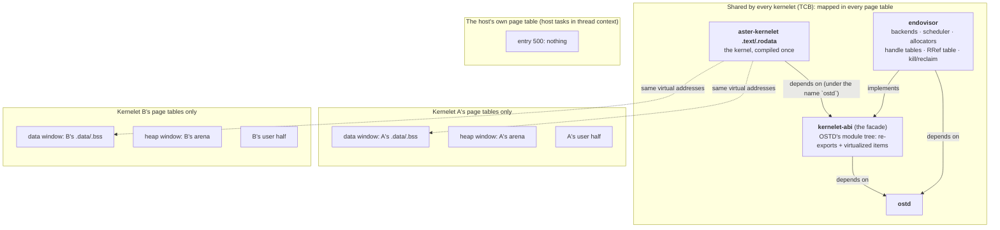

# The picture

Two things are absent from the picture on purpose. There is no edge from `aster-kernelet` to `ostd` or `endovisor`: the kernelet crate cannot name them. And there is no window in the host's own page table, and no kernelet's page tables map another kernelet's windows.
