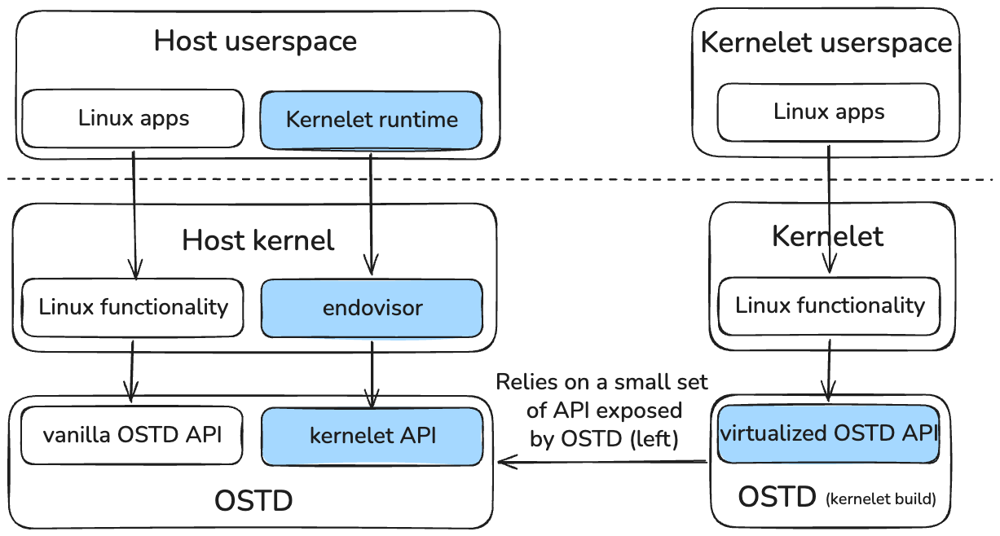

# Design

<figure class="bp-fig">

<figcaption>The kernelet architecture. Left: the host kernel, with the endovisor beside its Linux functionality, over OSTD; host user space holds ordinary Linux apps and the kernelet runtime. Right: a kernelet, the same Linux functionality over the kernelet build of OSTD, whose virtualized OSTD API relies only on the small kernelet API that the host's OSTD exposes. The dashed line is the user–kernel boundary.</figcaption>
</figure>

This chapter is the design of Asterinas Kernelets, built from the figure above. It answers four questions, and each page says which one it serves.

| question | pages |
|---|---|
| 1. What API does OSTD (host build) provide so that the endovisor can manage the lifecycle of kernelets and customize their behavior? | [The kernelet API: control half](kernelet-api-control.md) |
| 2. How is the API of OSTD (kernelet build) virtualized, item by item? | [Virtualizing OSTD](virtualizing-ostd/index.md) and its pages on [memory](virtualizing-ostd/memory.md), [tasks](virtualizing-ostd/tasks.md), [interrupts and time](virtualizing-ostd/interrupts-and-time.md), [user mode](virtualizing-ostd/user-mode.md), [devices](virtualizing-ostd/devices.md) and [the rest](virtualizing-ostd/the-rest.md) |
| 3. What API does OSTD (host build) expose to OSTD (kernelet build), and how does a call cross? | [The kernelet API: service half](kernelet-api-service.md) |
| 4. How is an OCI-compatible kernelet runtime built on the endovisor's user-space ABI, and how is the endovisor built on OSTD? | [The endovisor](endovisor.md) and [The kernelet runtime](kernelet-runtime.md) |

Two pages come before the questions, because every answer depends on them: [Boundaries and trust](principles.md) names the interfaces and states the invariants, and [Builds and images](builds-and-images.md) fixes how the two builds are produced and how the kernelet image is laid out and entered. Four pages come after: [Faults, termination, and reclamation](faults-and-reclamation.md) and [Channels](channels.md) cut across the resources, and [The endovisor](endovisor.md) and [The kernelet runtime](kernelet-runtime.md) answer the fourth question.

In this chapter:

- [Boundaries and trust](principles.md)
- [Builds and images](builds-and-images.md)
- [The kernelet API: control half](kernelet-api-control.md)
- [The kernelet API: service half](kernelet-api-service.md)
- [Virtualizing OSTD](virtualizing-ostd/index.md)
  - [Memory](virtualizing-ostd/memory.md)
  - [Tasks, scheduling, and CPUs](virtualizing-ostd/tasks.md)
  - [Interrupts and time](virtualizing-ostd/interrupts-and-time.md)
  - [User mode](virtualizing-ostd/user-mode.md)
  - [Devices](virtualizing-ostd/devices.md)
  - [Boot, power, panic, and the rest](virtualizing-ostd/the-rest.md)
- [Faults, termination, and reclamation](faults-and-reclamation.md)
- [Channels](channels.md)
- [The endovisor](endovisor.md)
- [The kernelet runtime](kernelet-runtime.md)

The decisions and assumptions the chapter makes are collected in the [design register](../../notes/design-register.md), and the OSTD API it classifies is enumerated in the [OSTD API inventory](../../notes/ostd-api-inventory.md), both in The Notes.
