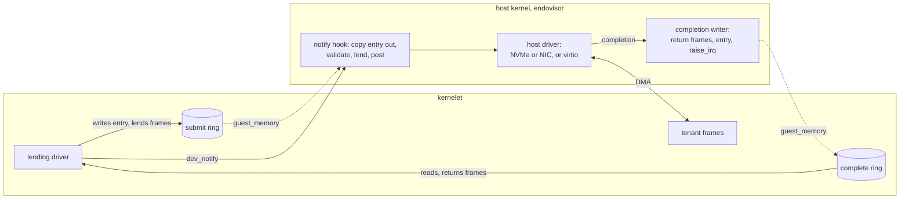
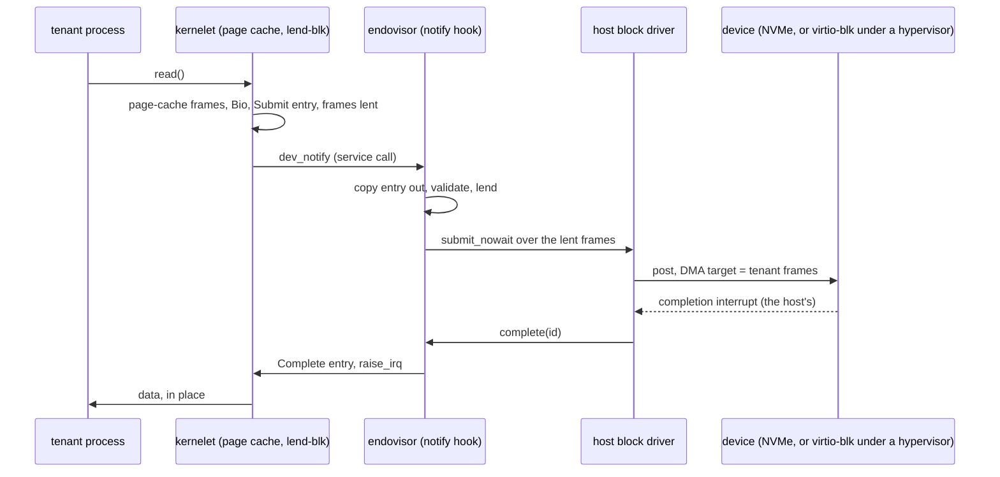
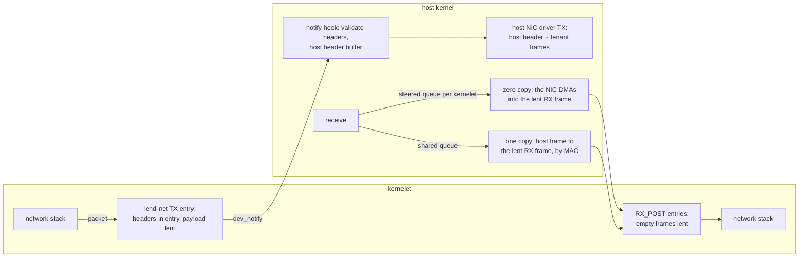
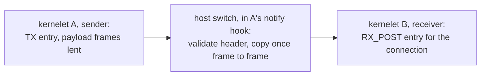

# Zero-copy I/O: the lending device model

*Cuts across questions 2 and 4. Specifies the second version of devices: a paravirtual device model built for kernelets rather than borrowed from virtio, whose block, network and inter-kernelet paths move data without the host copying it. The first version on the [Devices](virtualizing-ostd/devices.md) and [Channels](channels.md) pages stays as written. Every number says where it came from; the unit costs the argument rests on were measured on this book's host, one run (an Intel Xeon E3-1270 v6, Linux 6.8; script and raw output in [I/O microbenchmarks](../../notes/io-microbenchmarks.md)) and are labeled **measured here**.*

## Where the time goes {#where-the-time-goes}

A kernelet today sees virtio devices: rings in the tenant's memory where the driver writes **descriptors** (the address and length of a buffer) and notifies the device, which fills or drains the buffers and writes a completion. In a microVM the notification is a **VM exit**, a hardware transition out of the guest, and the work is done by a thread of the virtual machine monitor (the user-space program that runs the VM), which copies data between the guest's buffers and the host's files or sockets. In the first version of kernelets the notification is a function call, but the rest has the same shape: a host **device thread** wakes, copies, and raises an interrupt.

What does a copy cost against the other things a request pays for? Measured here:

| what | cost | note |
|---|---|---|
| copying one 1,500-byte packet | 14 ns hot in cache; **231 ns cold** | |
| copying one 4 KiB page | 33 ns hot; **457 ns cold** | cold is the realistic case for I/O data: 9 GB/s |
| copying 64 KiB | 1.2 µs hot; 6.4 µs cold | 10 GB/s cold |
| copying a 2 MiB grain | 61 µs hot; 156 µs cold | 13 GB/s cold |
| waking a thread on another CPU and being woken back | 5.8 µs round trip | **about 3 µs per wakeup** |
| unmapping one 4 KiB page while three other CPUs run this process | 2.9 µs; 4.0 µs for a protect-and-restore pair | a TLB shootdown, which any change of ownership pays |

Published: on 2013 hardware a VM exit with the device emulation it triggers cost 3–10 µs, a device register access 1.2 µs when the kernel part of the hypervisor handled it and 3.7 µs when a user-space monitor did, against 100–200 ns natively; a VM with an emulated network card reached about 100,000 packets per second on transmit, against about 1 million per core through the socket API on bare metal (Rizzo, Lettieri and Maffione, ANCS 2013, sections 2.1 and 2.4). Firecracker's block device does about 13,000 I/O operations per second where the same hardware does 340,000 natively (Agache et al., NSDI 2020, evaluation).

Two things follow. **For small requests the copy is noise**: 14–231 ns against a 3 µs wakeup or a 1–10 µs exit, so a "zero-copy" packet path that still wakes a thread per packet has saved nothing measurable. **For bulk the copy is the bill**: one host core copies about 10 GB/s cold, so a sandbox moving 10 GB/s costs a core in copying alone. The metric this page optimizes is therefore **host CPU per request as a function of request size**: a fixed term (exits, wakeups, crossings, validation) plus a per-byte term (copies). The design attacks both; [the argument](zero-copy-io.md#the-argument) is made for both.

## The idea {#the-idea}

A **lending device** is a device you lend frames to. Its rings live in the kernelet's memory like virtio's, and the host reads and writes them only through `guest_memory`, the [control half](kernelet-api-control.md)'s checked accessor, which refuses any range outside the kernelet's grant; nothing is mapped read-write on both sides. What an entry carries is different: not addresses into some buffer, but a list of the kernelet's own **frames**, lent to the device for the life of one request. (A kernelet's memory is a set of 2 MiB **grains** the host has granted it, recorded per grain in the host's **owner array**; see [Memory](virtualizing-ostd/memory.md).) The host checks in constant time that each frame's grain belongs to the kernelet, marks it lent, and hands the frame's address straight to the host's own device driver as a DMA target. The physical device, or on a cloud host the hypervisor beneath the host's virtio driver, reads from or writes into the tenant's frame. When the device completes, the host marks the frames returned, writes a completion entry and raises the kernelet's interrupt line with `raise_irq`, which wakes the **worker** thread that runs the kernelet's interrupt handlers ([Interrupts and time](virtualizing-ostd/interrupts-and-time.md)).



Three rules carry the design. **Lend**: a frame in flight is still the tenant's, but the tenant's kernel cannot free or reuse it, enforced twice ([lending](zero-copy-io.md#lending)). **The host acts only on bytes it copied out**: an entry is read whole, once, into host memory and validated there, and every header the host or the device interprets is transmitted from the host's copy, so nothing the host has checked can be changed under it. **No thread on the host's fast path**: submission happens in the notify call, bounded and without sleeping, and completion comes from the host driver's completion path; a device thread exists only for a backend that must sleep.

## Rings, entries and notifications {#rings}

A lending device has a **submit ring** and a **complete ring**, each a power-of-two array of fixed-size entries in the kernelet's grant, at most 256 entries (chosen, virtio's ceiling), registered at attach with `dev_ring_set`, which pins their grains once and is refused while any request is in flight. The kernelet writes the submit ring and reads the complete ring; the host does the reverse; the counters each side publishes sit in its ring's first entry.

```rust
// ostd::kernelet::abi. Submit: kernelet-written, host-read through guest_memory.
#[repr(C)] pub struct Submit {
    pub id: u32,          // unique among the device's requests in flight; echoed back
    pub op: u16,          // READ, WRITE, FLUSH, TX, RX_POST
    pub nseg: u16,        // segments lent, 1 to 16
    pub sector: u64,      // block ops: the first sector
    pub hdr_len: u16,     // TX: bytes of `hdr` that are the packet's headers
    pub csum_start: u16,  // TX offload: where the checksum starts, and where it is stored
    pub csum_off: u16,
    pub gso_size: u16,    // TX offload: segment size, 0 for none
    pub conn: u32,        // channel devices: the connection the entry belongs to
    pub hdr: [u8; 256],   // TX: the packet's headers; channel TX: the channel header
    pub seg: [Seg; 16],   // each a run of physically contiguous frames inside one grain
}
#[repr(C)] pub struct Seg { pub paddr: u64, pub off: u16, pub len: u32 }
// Complete: host-written, kernelet-read.
#[repr(C)] pub struct Complete { pub id: u32, pub status: u16, pub _pad: u16, pub bytes: u64 }
```

A segment is a run of physically contiguous frames inside one grain. Page-cache pages are single frames on the tree (checked: `vm/page_cache/mod.rs`, one `BioSegment` per page), so an entry carries up to sixteen pages, 64 KiB, and `lend-blk` splits larger requests into several entries, which the tree's block layer already does at 62 segments (checked: `request_queue.rs`, `max_nr_segments_per_bio`). A channel device uses the same five operations, `TX` and `RX_POST`, with `conn` set.

**Notify.** `dev_notify(dev)` is a service call with no pointer, like every other ([service half](kernelet-api-service.md)). Under the device's lock and without sleeping, the hook copies each new entry out of the submit ring **whole**, through `guest_memory`, and validates the copy:

- `op` valid for the device; `nseg` from 1 to 16; every `len` nonzero; `id` not in flight (a duplicate is a driver fault that stops the device until reset);
- every segment: `paddr` page-aligned, `off + len` inside the grain; the entry's total bytes at most the endovisor's request bound;
- block: `off` and `len` sector multiples; `[sector, sector + bytes)` inside the device's extent, in checked arithmetic;
- `TX`: `hdr_len` from an Ethernet plus IP header to 256 bytes; `csum_start + csum_off + 2` inside the packet; `gso_size` zero or at least 512 (chosen: one entry yields at most 128 segments);
- `RX_POST`: the frame at least the device's maximum frame length.

For each segment it then advances the grain's lend count with one compare-and-swap on the **owner-and-lend word** ([lending](zero-copy-io.md#lending)); if a swap fails, the earlier ones are undone and the entry is completed with an error. Then it **posts the request to the host driver**: a block request over the lent frames, or a transmit whose first segment is a host-owned buffer holding the validated header, followed by the lent frames. A request the host driver cannot take now waits in a per-device **inbox** of ring-size slots preallocated at attach, the first version's inbox with the copy removed (register D50). The hook handles at most 32 entries per call (chosen) and leaves the rest for the next notify or completion, so its worst case is 32 entries and 512 swaps, *estimated* at 20–60 µs with cold owner words, under the driver's own lock as across a real notify.

**Complete.** The host driver's completion path, which may be an interrupt context, calls the model's `complete(dev, id, status, bytes)`: it takes each lent grain's count down, writes a `Complete` entry through `guest_memory`, which sleeps nowhere and is what the first version's hook already calls under a lock, and calls `Kernelet::raise_irq`, with a `Release` store ordering the entry before the line. The kernelet's worker runs the driver's handler, which drains the ring.

**Interrupt suppression.** The submit ring's first entry holds a **polling bit** the kernelet writes. While it is set the host writes completions and raises nothing. For requests the kernelet initiates (`READ`, `WRITE`, `FLUSH`, `TX`) the driver sets the bit when more than four are in flight (chosen), spins on the complete ring from the thread it already owns (the kernel proper's per-device block thread, `device/registry/block.rs`; the interface's poll thread, `net/iface/poll.rs`, which sleeps on a timer today and becomes a spinner while the bit is set), and clears it when fewer than four remain. For receives it is the other shape: an interrupt sets the bit, the driver drains completions until the ring is empty, then clears it. In both shapes the driver reads the ring once more after clearing, and host and driver each put a full `SeqCst` fence between writing their flag and reading the other's, the classic two-flag hand-off; without it a completion can be missed and, lines being edge-triggered, stays missed until the next one. The poll loops are new code in the kernel proper's drivers.

## Lending, and what enforces it {#lending}

A lent frame is still the tenant's: its processes may read and write it. What must not happen is that it **changes hands** while the device holds its address: freed and reallocated inside the kernelet, or returned to the host and granted to another tenant. Two independent mechanisms prevent this.

**In vOSTD, ownership.** For block, the tree's own types are the lend: a `BioSegment` holds a `DmaStream` that owns its frames until the request completes (checked: `bio.rs`), and the driver keeps the bio in its table of requests in flight; no new type is needed. For network, the driver holds the frame it lent in the same way until the completion arrives. The kernel proper is `forbid(unsafe_code)` and gets frames back only through the driver, so no safe code can free a lent frame. This is what a memory-safe kernel gets for free: the rule Linux enforces with reference counts and driver discipline is ownership here.

**In the host, a count.** The owner array's entry becomes an **owner-and-lend word**: the kernelet's 16-bit slot, its 32-bit generation, and a 16-bit lend count in one 64-bit word. The hook advances the count by one compare-and-swap that fails if the owner is not this kernelet or the count is at its ceiling (unreachable without a bug: a device holds at most 4,096 lends on one grain), and completion takes it down. A grain with a nonzero count is not released, not moved, and not freed at destroy until the count is zero: the count joins the pin count in destroy's drain list, and an address held by a host driver's in-flight request joins the exceptions of invariant I4 ([Faults, termination, and reclamation](faults-and-reclamation.md)). At `on_dying` the endovisor cancels what the host driver can cancel; destroy never waits (register D36), and the kernelet stays a `Zombie` until the last request completes, which is bounded only if the host drivers time requests out, which the tree's do not (assumption A14, **[unverified]**). The count is what protects other tenants if vOSTD is wrong: a compromised vOSTD can corrupt its own data through a reused frame, and cannot make the host grant that frame to anyone else while a device may still write it.

**What a tenant can still do, and why it does not matter.** It can rewrite a transmit buffer in flight, as Linux's `MSG_ZEROCOPY` allows, or write a page during writeback and store it torn, as on every operating system with a page cache; each effect stays inside the tenant, because everything the host or the device decides on comes from the host's copy. It cannot program the device: a frame is written only because a validated entry named it and host code posted it. On bare metal the host's IOMMU (the unit that bounds what a device may address) holds one domain for the host's memory, into which a kernelet's grains are mapped once at grant: a device-side mapping, not a CPU mapping, which gives the tenant no reach and protects against a faulty device only. On a cloud host the hypervisor bounds every DMA to the host's memory.

## Block {#block}

The kernelet's block layer already works in frames: a read is a `Bio` whose segments are page-cache frames (checked on the tree: `bio.rs`, `vm/page_cache/mod.rs`; writeback still copies each page into a pool segment, which the kernel proper could stop doing on both sides of the comparison). The `lend-blk` driver implements the same `enqueue` the virtio-blk driver does (checked: `device/block/device.rs`) but writes one `Submit` per sixteen pages. What the model removes is the host side.



**Two tiers.** At **tier 2**, the hardware tier, the device is backed by an **extent**: a contiguous range of a host block device or a partition. A host file is not an extent until the host file system can pin a file's blocks against truncation and reallocation, as a swap file is pinned on Linux; the tree's file systems cannot, and a file whose blocks moved would let a tenant's DMA land on another tenant's blocks. The hook posts the request to the host's block driver as a DMA over the lent frames; the device writes into the tenant's page cache, and the host's own page cache is not involved. **Tier 1** is the first version's file-backed device behind a lending ring: a device thread reads the file into the lent frames with `read_at`, one copy from the host's page cache.

**What the tree does not have yet** (assumption A14). The host block layer submits through a sleeping lock and a per-device thread, virtio-blk allocates per request and spins when descriptors run short, and the NVMe driver issues one command at a time and sleeps for it. Tier 2 needs a non-sleeping, non-allocating **`submit_nowait`** in both, an asynchronous NVMe driver, and request timeouts. Until they exist, tier 2 block pays one host-thread wakeup per batch, the same fixed cost as a kernel `vhost` backend, and still no copy.

## Network {#network}

On the tree the stack's socket buffers are byte rings in the heap, the stack copies each packet into a heap buffer the driver supplies, and the virtio driver copies it again into a DMA pool (checked: `aster-bigtcp/src/socket/unbound.rs`; `network/src/driver.rs`, `TxToken::consume`; `buffer.rs`, `TxBuffer::new`). A `lend-net` driver given a heap buffer must copy it into a frame too, so on the kernelet side it saves nothing until the kernel proper hands drivers frame-backed buffers, which is that side's work and the same on both sides of every comparison here. What this page removes is the host's copy. The user ABI is unchanged.



**Transmit.** The driver writes the packet's Ethernet, IP and transport headers, up to 256 bytes, into the entry's `hdr`, the offload fields, and the payload as segments. The hook validates the copy: the source MAC is the device's and the source IP is one the sandbox was given; an ARP packet's sender fields and a neighbor-discovery packet's source and target fields carry those same addresses, or the packet is dropped, so a tenant cannot poison its neighbors' caches; VLAN tags are refused. It builds the offload header the NIC wants from the validated fields (the tree's virtio-net driver emits it as `VirtioNetHdr`) and posts a transmit to the host NIC driver, virtio-net on a cloud host: the host header first, then the lent frames from offset `hdr_len`. A packet whose headers exceed 256 bytes is sent whole in one lent frame; the hook copies its headers out, validates them, and transmits its own copy first with the frame offset past them, the same construction, so no header the device reads is tenant memory. The tree's virtio queue takes any buffer type with an address and a length (checked: `virtio/src/dma_buf.rs`), one type per side of a request, so the host header and the lent frames share one (A14).

**Receive, two tiers.** A packet lands in the host's receive buffers first, so the tier depends on whether the tenant's frames can *be* those buffers. **Tier 2** needs a **per-kernelet receive queue**: a NIC that steers by destination MAC to a queue of its own (a virtual function, which is a slice of a NIC that behaves as a separate device, or a filter per kernelet on a multi-queue NIC), or on a cloud host one virtio-net device per kernelet. Then the frames the kernelet lends with `RX_POST` are what the host driver posts to that queue, the device DMAs the packet into the tenant's frame, and the host completes the entry with the length: zero copies. **Tier 1** is a shared queue: the host receives into its own frame, looks the destination MAC up in its table (a broadcast goes to every kernelet on the segment, a MAC not in the table is dropped), copies the packet into that kernelet's next lent frame (231 ns cold for 1,500 bytes), completes it, and recycles its own frame. That copy is real, 12–77 % of the polling row's fixed cost in the argument below, and the design calls tier 1 receive what it is: one copy.

## Between kernelets {#between-kernelets}

The Channels page sends every inter-kernelet byte through a vsock switch that copies twice and hops through two device threads. The `lend-chan` device keeps the vsock socket layer and replaces the transport beneath it, with one rule that makes credit and frames the same thing: a receiver lends empty frames with `RX_POST`, each tagged with its connection, and its socket layer advertises to the peer exactly the credit those frames hold. A sender's `TX`, the vsock header in `hdr` and the payload lent, is therefore never sent without a posted frame on that connection; the host's switch, in the sender's notify hook, validates the header as today, takes the connection's next posted frame through the receiver's `guest_memory`, which refuses a receiver that is dying, **copies once, frame to frame**, and completes both entries. A `TX` with no posted frame is a protocol violation, completed with an error, not queued, so one slow connection cannot stall the others, which is the head-of-line rule the Channels page keeps (register D51). The copy is capped at 16 KiB per entry (chosen), 1.6 µs cold, because it runs in a hook with preemption off.



Moving whole grains instead of copying them stays the Channels page's extension. The measurements set its bar: a grain is the unit of ownership, so nothing smaller can move; moving one costs an unmap with a TLB shootdown, 3–4 µs, plus table edits, against 156 µs to copy it cold; and its preconditions, a grain no other reference holds, a run split out of the grant table, and the end of the assumption that a kernelet's memory only grows, are that page's to discharge.

## The argument {#the-argument}

The metric: host CPU per request, a fixed term plus a per-byte term. The first table counts what each path pays per request. The microVM rows are on bare metal, as Firecracker's paper measured; a kernelet host that is itself a cloud VM pays its hypervisor's exits for its own virtio notifications, as every process on that host does, and the kernelet rows are then relative to that. *Vhost* is a Linux host-kernel backend for virtio that takes the user-space monitor off the data path; *vhost-user*, *SPDK* and *DPDK* are user-space backends that spin on a dedicated core so that no notification is needed.

| per request | VM exits | thread wakeups | host copies of the payload | source of the counts |
|---|---|---|---|---|
| microVM, user-space monitor, block (Firecracker) | 2–3 (notify, interrupt, acknowledge) | 1–2 (the monitor's thread; the guest's CPU thread if idle) | 1 (from the host page cache) | virtio's MMIO transport; Firecracker's paper |
| microVM, kernel `vhost`, network | 1–2 | 1 (the vhost thread) | 1 | vhost's design: the notification still exits |
| microVM, polling backend (`vhost-user`, SPDK, DPDK) | 0 under load | 0 | 1 | the backend spins on a dedicated core |
| microVM, virtual function passed through | 0 under load | 0 | 0 | the guest drives the NIC slice itself |
| **kernelet, lending, interrupt-driven** | **0** | **1** (the worker, at completion) | **0** at tier 2; 1 at tier 1 | this page |
| **kernelet, lending, polling** | **0** | **0** | **0** at tier 2 | this page |

Unit costs: an exit that returns to a user-space monitor, 3.7 µs in 2013 and **2–5 µs** today; an exit the kernel part of the hypervisor handles, 1.2 µs in 2013 and **0.5–2 µs** today (both assumption A15, **[unverified]**, scaled from Rizzo's figures); a wakeup about 3 µs measured here; the hook, up to sixteen owner words that may be cold plus one host driver submission, **0.3–2 µs** *estimated*; a cold 4 KiB copy 457 ns.

| fixed term per request | microVM, user-space monitor | microVM, `vhost` | kernelet, interrupt-driven | kernelet, polling |
|---|---|---|---|---|
| exits | 4–15 µs | 0.5–4 µs | 0 | 0 |
| wakeups | 3–6 µs | 3 µs | 3 µs | 0 |
| validation and posting | inside the monitor's time | inside the vhost thread's time | 0.3–2 µs | 0.3–2 µs |
| **total** | **7–21 µs** | **3.5–7 µs** | **3.3–5 µs** | **0.3–2 µs** |

Left out on purpose: the kernel proper's own hop to its block request thread, inside the tenant's budget on both sides; the reschedule interrupt `raise_irq` sends when a kernelet task occupies the worker's CPU; the host driver's own interrupt handling, which a native process pays too. The per-byte term is one cold copy for every microVM row but the virtual function, and none for the kernelet at tier 2: **0.1 core per GB/s**, nothing at a sandbox's usual rate and a whole core at 10 GB/s.

The claim, with its limits. **Per request, interrupt-driven, the lending model costs 1.4–6× less than a user-space monitor and about the same as `vhost`**: it removes every exit, and its one wakeup is the wakeup vhost pays too. **With polling it costs roughly 2–20× less than either**, because the poller is the kernelet's own thread on the tenant's own core: charged to the tenant, spinning only while that tenant has requests in flight. **Per byte, at tier 2, it removes the host copy**, which matters above a few GB/s per sandbox and is what SPDK and DPDK exist to remove; the kernelet gets it without a user-space driver, because the host's frames are the tenant's frames. **What it does not claim**: to beat a polling backend or a passed-through virtual function per request; that tier 1 receive is zero-copy; or that the hook's cost is measured or the block fast path exists on the tree, neither of which is true.

## Costs {#costs}

- Per device: two rings in the grant, pinned at attach, the inbox, and the host driver's queue entries the device may hold, bounded by the ring size; for tier 1 block, one device thread.
- Per request: one crossing per notify batch, one entry copy and validation, one compare-and-swap per segment, one host driver submission, one completion write, one `raise_irq` per completion batch or none under polling.
- Per grain: two bytes of lend count inside the owner word; one IOMMU mapping at grant on bare metal.
- Code that does not exist: host side, A14 (`submit_nowait`, a lent-range `BioSegment`, an asynchronous NVMe driver, request timeouts, a common buffer type for host headers and lent frames, a segment-taking transmit and a lent-frame receive path in virtio-net and the NIC drivers) and steering (A16); kernelet side, the three drivers, the poll loops, and frame-backed transmit buffers in the kernel proper.

## What this page decides {#decides}

- **The second version's devices are lending devices: rings in the kernelet's memory read through `guest_memory`, entries that lend the kernelet's own frames, host drivers that take those frames as DMA targets** (register D70).
- **The host and the device act only on bytes the host copied out of an entry and validated; every header a device reads is the host's copy** (register D71).
- **Lending is enforced by ownership in vOSTD and by a 16-bit lend count in the owner-and-lend word, advanced by one compare-and-swap with the owner check, rolled back on failure; a lent grain is never released, moved or freed** (register D72).
- **Submission happens in the notify hook, at most 32 entries per call, non-sleeping, into a `submit_nowait` of the host driver; a device thread exists only for a backend that sleeps** (register D73).
- **Interrupt suppression is a polling bit with a `SeqCst` fence on both sides: set above four initiated requests in flight, and for receives set on interrupt and cleared when the ring is empty** (register D74).
- **Network receive is zero-copy only with a per-kernelet receive queue; a shared queue costs one host copy, stated as such** (register D75).
- **Inter-kernelet transfer copies once, frame to frame, in the sender's hook, into a frame the receiver posted for that connection, credit being those frames; moving grains stays the Channels extension** (register D76).
- **On bare metal a kernelet's grains are mapped into the host's IOMMU domain at grant, not per request** (register D77).

Published figures: L. Rizzo, G. Lettieri, V. Maffione, "Speeding up packet I/O in virtual machines", ANCS 2013; A. Agache et al., "Firecracker: lightweight virtualization for serverless applications", NSDI 2020; W. de Bruijn, E. Dumazet, "sendmsg copy avoidance with MSG_ZEROCOPY", netdev 2.1, 2017. Measured-here figures, with the script and raw output: [I/O microbenchmarks](../../notes/io-microbenchmarks.md).
