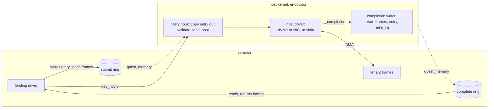
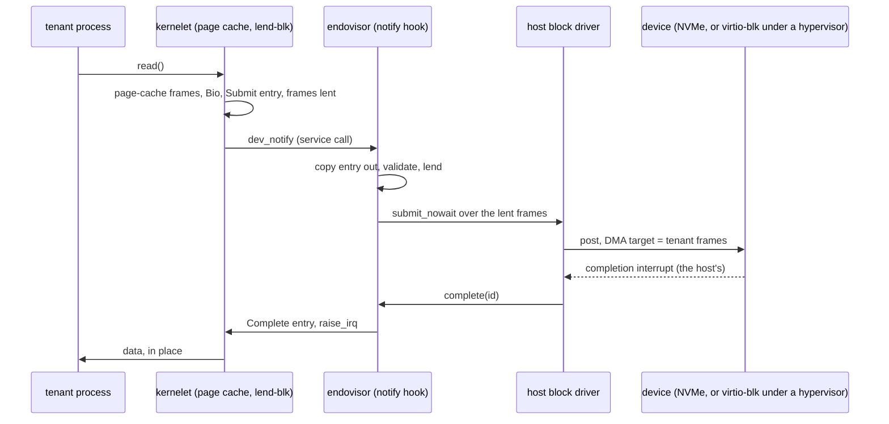
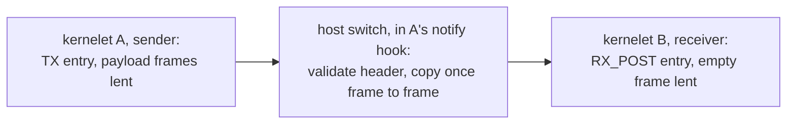

# Zero-copy I/O: the lending device model

*Cuts across questions 2 and 4. Specifies the second version of devices: a paravirtual device model built for kernelets rather than borrowed from virtio, whose block, network and inter-kernelet paths move data without the host copying it. The first version on the [Devices](virtualizing-ostd/devices.md) and [Channels](channels.md) pages stays as written. Every number says where it came from; the unit costs the argument rests on were measured on this book's host (an Intel Xeon E3-1270 v6, Linux 6.8; script and raw output in [I/O microbenchmarks](../../notes/io-microbenchmarks.md)) and are labeled **measured here**.*

## Where the time goes {#where-the-time-goes}

A kernelet today sees virtio devices: a pair of rings in the tenant's memory, where the driver writes descriptors that point at buffers and notifies the device, and the device fills or drains the buffers and writes a completion. In a microVM the notification is a **VM exit**, a hardware transition out of the guest that the hypervisor handles, and the work is done by a thread of the virtual machine monitor (the user-space program that runs the VM), which copies data between the guest's buffers and the host's files or sockets. In the first version of kernelets the notification is a function call, but the rest has the same shape: a host **device thread** wakes, copies, and raises an interrupt.

What does a copy cost against the other things a request pays for? Measured here:

| what | cost | note |
|---|---|---|
| copying one 1,500-byte packet | 14 ns hot in cache; **231 ns cold** | |
| copying one 4 KiB page | 33 ns hot; **457 ns cold** | cold is the realistic case for I/O data: 9 GB/s |
| copying 64 KiB | 1.2 µs hot; 6.4 µs cold | 10 GB/s cold |
| copying a 2 MiB grain | 61 µs hot; 156 µs cold | 13 GB/s cold |
| waking a thread on another CPU and being woken back | 5.8 µs round trip | **about 3 µs per wakeup** |
| unmapping one 4 KiB page while three other CPUs run this process | 2.9 µs; 4.0 µs for a protect-and-restore pair | a TLB shootdown, which any change of ownership pays |

Published: on 2013 hardware a VM exit and re-entry with the device emulation it triggers cost 3–10 µs, a device register access 1.2 µs when the kernel part of the hypervisor handles it and 3.7 µs when a user-space monitor does, against 100–200 ns natively; a guest driving its network through the socket API was limited to about 100,000 packets per second per core (Rizzo, Lettieri and Maffione, ANCS 2013, sections 1 and 2.2). Firecracker's paper reports its block device at about 13,000 IOPS where the same hardware does 340,000 natively (Agache et al., NSDI 2020, the evaluation section).

Two things follow. **For small requests the copy is noise**: 14–231 ns against a 3 µs wakeup or a 1–10 µs exit, so a "zero-copy" packet path that still wakes a thread per packet has saved nothing measurable. **For bulk the copy is the bill**: at 9–13 GB/s cold, one host core copies about 10 GB/s, so a sandbox moving 10 GB/s costs a core in copying alone. The metric this page optimizes is therefore **host CPU per request as a function of request size**: a fixed term (exits, wakeups, crossings, validation) plus a per-byte term (copies). The design attacks both, and [the argument](zero-copy-io.md#the-argument) is made for both.

## The idea {#the-idea}

A **lending device** is a device you lend frames to. Its rings live in the kernelet's memory like virtio's, and the host reads and writes them only through `guest_memory`, the [control half](kernelet-api-control.md)'s checked accessor, which pins the grains it touches and refuses any range outside the kernelet's grant; nothing is mapped read-write on both sides. What an entry carries is different: not addresses into some buffer, but a list of the kernelet's own **frames**, lent to the device for the life of one request. (A kernelet's memory is a set of 2 MiB **grains** the host has granted it, recorded per grain in the host's **owner array**; see [Memory](virtualizing-ostd/memory.md).) The host checks in constant time that each frame's grain belongs to the kernelet, marks it lent, and hands the frame's address straight to the host's own device driver as a DMA target. The physical device, or on a cloud host the hypervisor beneath the host's virtio driver, reads from or writes into the tenant's frame. When the device completes, the host marks the frames returned, writes a completion entry and raises the kernelet's interrupt line with `raise_irq`, which wakes the **worker** thread that runs the kernelet's interrupt handlers ([Interrupts and time](virtualizing-ostd/interrupts-and-time.md)).



Three rules carry the design. **Lend**: a frame in flight is still the tenant's, but the tenant's kernel cannot free or reuse it, enforced twice ([lending](zero-copy-io.md#lending)). **The host acts only on bytes it copied out**: an entry is read whole, once, into host memory and validated there, and a network header travels inside the entry, so nothing the host has checked can be changed under it. **No thread on the host's fast path**: submission happens in the notify call, bounded and without sleeping, and completion comes from the host driver's completion path; a device thread exists only for a backend that must sleep.

## Rings, entries and notifications {#rings}

A lending device has a **submit ring** and a **complete ring**, each a power-of-two array of fixed-size entries in the kernelet's grant, registered at attach with `dev_ring_set`, which is refused while any request is in flight. The kernelet writes the submit ring and reads the complete ring; the host does the reverse; the counters each side publishes sit in its ring's first entry. A ring holds at most 256 entries (chosen, virtio's transport ceiling).

```rust
// ostd::kernelet::abi. Submit: kernelet-written, host-read through guest_memory.
#[repr(C)] pub struct Submit {
    pub id: u32,          // unique among the device's requests in flight; echoed back
    pub op: u16,          // READ, WRITE, FLUSH, TX, RX_POST
    pub nseg: u16,        // segments lent, at most 16
    pub sector: u64,      // block ops: the first sector
    pub hdr_len: u16,     // TX: bytes of `hdr` that are the packet's headers
    pub hdr: [u8; 256],   // TX: the packet's headers; on a channel device, the channel header
    pub seg: [Seg; 16],   // each a run of whole frames inside one grain
}
#[repr(C)] pub struct Seg { pub paddr: u64, pub off: u16, pub len: u32 }
// Complete: host-written, kernelet-read.
#[repr(C)] pub struct Complete { pub id: u32, pub status: u16, pub _pad: u16, pub bytes: u64 }
```

A segment is a run of frames inside one grain, so a 2 MiB request needs one owner check, and sixteen segments cover any request the tree's block layer builds (its drivers allow 62 segments of any length; checked on the tree: `request_queue.rs`, `max_nr_segments_per_bio`; `bio.rs`, `BioSegment::new_from_segment`), which `lend-blk` splits at sixteen. A channel device uses the same five operations, `TX` and `RX_POST` with the channel header in `hdr`.

**Notify.** `dev_notify(dev)` is a service call with no pointer, like every other ([service half](kernelet-api-service.md)). Under the device's lock and without sleeping, the hook copies each new entry out of the submit ring **whole**, through `guest_memory`, and validates the copy: `nseg` at most 16; every segment page-aligned, inside one grain, with `off + len` inside it; for block, `off` and `len` multiples of the sector size and `[sector, sector + bytes)` inside the device's extent; for `TX`, `hdr_len` at most 256; `id` not in flight. For each segment it then takes the grain's **owner-and-lend word**, one 64-bit word holding the owner and a 32-bit lend count, and advances the count by one compare-and-swap that fails if the owner is not this kernelet; the check and the count are one atomic step. Then it **posts the request to the host driver**: a block request over the lent frames, or a transmit whose first segment is the header from the copied entry in a host-owned buffer, followed by the lent frames. A request the host driver cannot take now waits in a per-device **inbox** of ring-size slots preallocated at attach, the first version's inbox with the copy removed (register D50). An entry that fails validation is completed at once with an error status. The hook's worst case is one pass over a full ring of 256 entries, *estimated* at 30–100 µs, and the driver holds its own lock for that long, as across a real notify.

**Complete.** The host driver's completion path calls the model's `complete(dev, id, status, bytes)`: it takes each lent grain's count down, writes a `Complete` entry through `guest_memory`, and calls `Kernelet::raise_irq`, with a `Release` store ordering the entry before the line, the first version's ordering. The kernelet's worker runs the driver's handler, which drains the ring.

**Interrupt suppression.** The submit ring's first entry holds a **polling bit** the kernelet writes. While it is set the host writes completions and raises nothing. The driver sets it when more than four requests are in flight (chosen) and then polls the complete ring from a thread it already owns: for block, the kernel proper's per-device request thread (checked on the tree: `device/registry/block.rs`), for network the interface's poll thread (checked: `net/iface/poll.rs`); when in-flight requests fall below four it clears the bit and reads the ring once more. Host and driver each write their flag and then read the other's, so both sides put a full `SeqCst` fence between the write and the read, the classic two-flag hand-off; without it a completion can be missed and, lines being edge-triggered, stays missed until the next one. This is virtio's event index reduced to one bit, and it is what removes the per-request wakeup at high rates; the poll loops are new code in the kernel proper's drivers.

## Lending, and what enforces it {#lending}

A lent frame is still the tenant's: its processes may read and write it. What must not happen is that it **changes hands** while the device holds its address: freed and reallocated inside the kernelet, or returned to the host and granted to another tenant. Two independent mechanisms prevent this.

**In vOSTD, a type.** The driver turns each frame it lends into a `LentFrame`, which holds a reference to the frame's metadata as `Frame` does on the tree and lives in the driver's table of requests in flight; it is dropped only when the request's completion arrives. The kernel proper is `forbid(unsafe_code)` and gets frames back only through the driver, so no safe code can free a lent frame. This is what a memory-safe kernel gets for free: the rule Linux enforces with reference counts and driver discipline is a type here.

**In the host, a count.** The lend count in the owner-and-lend word is taken up in the hook and down at completion. Anything that would move a grain out of the kernelet consults it: a grain with a nonzero count is not released, not moved, and not freed at destroy until the count is zero. The count joins the pin count in the first step of destroy's drain list, and a physical address held by a host driver's in-flight request joins the exceptions of invariant I4 ([Faults, termination, and reclamation](faults-and-reclamation.md)). Destroy cancels the device's requests in the host driver where it can and otherwise waits for them, bounded by the driver's own timeout; the kernelet is a `Zombie` for that long. The count is what protects other tenants if vOSTD is wrong: a compromised vOSTD can reuse its own lent frame and corrupt its own data, and cannot make the host grant that frame to anyone else while a device may still write it.

**What a tenant can still do, and why it does not matter.** It can rewrite a transmit buffer in flight and send what it wrote last, as Linux's `MSG_ZEROCOPY` allows, or write a page during writeback and store it torn, as on every operating system with a page cache; each effect stays inside the tenant, because everything the host decides on, sector, lengths and headers, was copied out of the entry before the check. It cannot program the device: a frame is written only because a validated entry named it and host code posted it. On bare metal the host's IOMMU (the unit that bounds what a device may address) holds one domain for the host's memory, and a kernelet's grains are mapped into it once at grant, so no request maps or unmaps anything; on a cloud host the hypervisor bounds every DMA to the host's memory. Neither is part of the tenant isolation argument.

## Block {#block}

The kernelet's block layer already works in frames: a request is a `Bio` whose segments are page-cache frames (checked on the tree: `bio.rs`). The `lend-blk` driver implements the same `enqueue` the virtio-blk driver does (checked: `device/block/device.rs`) but writes one `Submit` per bio, its frames wrapped as `LentFrame`s. Nothing on the kernelet side is copied, which was already true; what the model removes is the host side.



**Two tiers.** At **tier 2**, the hardware tier, the device is backed by an **extent**: a contiguous range of a host block device, a partition, or a range list the endovisor resolves once at attach by asking the host file system for a file's blocks. The hook posts the request to the host's block driver as a DMA over the lent frames; the device writes into the tenant's page cache, and the host's own page cache is not involved. **Tier 1** is the first version's backend behind a lending ring: a host file, read into the lent frames by a device thread with the host's `read_at`, one copy from the host's page cache. It is kept for hosts whose file system cannot give extents.

**What the tree does not have yet.** Tier 2 needs host changes, assumption A14. The tree's host block layer submits a request by taking a sleeping lock, queueing it, and waking a per-device kernel thread that calls the driver (checked: `request_queue.rs`, `enqueue`; `device/registry/block.rs`); its virtio-blk driver allocates per request and spins when descriptors run short (checked: `device/block/device.rs`, `read`); its NVMe driver issues one command at a time and sleeps for it (checked: `nvme/src/device/block_device.rs`, `submit_and_wait`). The model needs a **non-sleeping, non-allocating submission**, `submit_nowait`, in the host block device and in both drivers, with per-request objects taken from the inbox, and an asynchronous NVMe driver. Until they exist, tier 2 block pays one host-thread wakeup per batch, the same fixed cost as a kernel `vhost` backend, and still no copy.

## Network {#network}

On the tree the stack's socket buffers are byte rings in the heap, the stack copies each packet into a buffer the driver supplies, and the virtio driver copies it again into a DMA pool (checked: `aster-bigtcp/src/socket/unbound.rs`; `network/src/driver.rs`, `TxToken::consume`; `buffer.rs`, `TxBuffer::new`). The `lend-net` driver removes the last of those copies by lending the buffer it was given; the stack's own copies are the kernel proper's, the same on both sides of every comparison here, and a scatter-gather path through the stack is the kernel proper's future work. The user ABI is unchanged.


**Transmit.** The driver writes the packet's Ethernet, IP and transport headers, up to 256 bytes, into the entry's `hdr` and the payload as segments; a packet with longer headers is sent whole as one lent frame and the host copies its header out. The hook checks that the source MAC is the device's and the source IP is one the sandbox was given, rewriting or dropping otherwise as the vsock switch does for a sender's identifier ([Channels](channels.md)), prepends the offload header the NIC wants (checksum and segmentation, which the tree's virtio-net driver emits as `VirtioNetHdr`), and posts a transmit of two or more segments, host header first, to the host NIC driver: the host's virtio-net on a cloud host, the NIC driver on bare metal. The payload frames are the DMA source, unread by the host. The tree's virtio queue takes any buffer type with an address and a length (checked: `virtio/src/dma_buf.rs`), so a lent frame needs no queue change; the host virtio-net driver's copying `send` needs a segment-taking entry point (A14).

**Receive, two tiers.** A packet lands in the host's receive buffers first, so the tier depends on whether the tenant's frames can *be* those buffers. **Tier 2** needs a **per-kernelet receive queue**: a NIC that steers by destination MAC to a queue of its own (a virtual function, which is a slice of a NIC that behaves as a separate device, or a filter per kernelet on a multi-queue NIC), or on a cloud host one virtio-net device per kernelet. Then the frames the kernelet lends with `RX_POST` are what the host driver posts to that queue, the device DMAs the packet into the tenant's frame, and the host completes the entry with the length: zero copies. **Tier 1** is a shared queue: the host receives into its own frame, reads the destination MAC, finds the kernelet, copies the packet into that kernelet's next lent frame (231 ns cold for 1,500 bytes), completes it, and recycles its own frame. That copy is real, a third to a half of the polling row's fixed cost in the argument below, and the design calls tier 1 receive what it is: one copy.

## Between kernelets {#between-kernelets}

The Channels page sends every inter-kernelet byte through a vsock switch that copies twice and hops through two device threads. The `lend-chan` device keeps the vsock socket layer and its credit rules and replaces the transport beneath it: a receiver lends empty frames with `RX_POST`; a sender lends its payload frames with `TX`, the vsock header in `hdr`. The host's switch, in the sender's notify hook, validates the header as today, takes the receiver's next posted frame, **copies once, frame to frame**, and completes both entries. One copy and no device thread, against two copies and two threads; the copy is bounded by the receiver's credit and by the entry.



Moving whole grains instead of copying them stays the Channels page's extension. The measurements set its bar: an unmap with a TLB shootdown costs 3–4 µs and a 2 MiB copy 61–156 µs, so a move pays off only above about 256 KiB, and its preconditions, a grain no other reference holds, a run split out of the grant table, and the end of the assumption that a kernelet's memory only grows, are that page's to discharge.

## The argument {#the-argument}

The metric: host CPU per request, a fixed term plus a per-byte term. The first table counts what each path pays per request. The microVM rows are on bare metal, as Firecracker's paper measured; a kernelet host that is itself a cloud VM pays its own hypervisor's exits for its own virtio doorbells, as every process on that host does, and the kernelet rows are then relative to that. *Vhost* is a Linux host-kernel backend for virtio that takes the user-space monitor off the data path; *vhost-user*, *SPDK* and *DPDK* are user-space backends that spin on a dedicated core so that no notification is needed.

| per request | VM exits | thread wakeups | host copies of the payload | source of the counts |
|---|---|---|---|---|
| microVM, user-space monitor, block (Firecracker) | 2–3 (notify, interrupt, acknowledge) | 1–2 (the monitor's thread; the guest's CPU thread if idle) | 1 (from the host page cache) | virtio's MMIO transport; Firecracker's paper |
| microVM, kernel `vhost`, network | 1–2 | 1 (the vhost thread) | 1 | vhost's design: the notification still exits |
| microVM, polling backend (`vhost-user`, SPDK, DPDK) | 0 under load | 0 | 1 | the backend spins on a dedicated core |
| microVM, virtual function passed through | 0 under load | 0 | 0 | the guest drives the NIC slice itself |
| **kernelet, lending, interrupt-driven** | **0** | **1** (the worker, at completion) | **0** at tier 2; 1 at tier 1 | this page |
| **kernelet, lending, polling** | **0** | **0** | **0** at tier 2 | this page |

Unit costs: an exit that returns to a user-space monitor, 3.7 µs in 2013 and **2–5 µs** today; an exit the kernel part of the hypervisor handles, 1.2 µs in 2013 and **0.5–2 µs** today (both assumption A15, **[unverified]**, scaled from Rizzo's figures); a wakeup about 3 µs measured here; the hook, up to sixteen owner words that may be cold plus one host driver submission, **0.3–2 µs** *estimated*; a cold 4 KiB copy 457 ns.

| fixed term per request | microVM, user-space monitor | microVM, `vhost` | kernelet, interrupt-driven | kernelet, polling |
|---|---|---|---|---|
| exits | 4–15 µs | 0.5–4 µs | 0 | 0 |
| wakeups | 3–6 µs | 3 µs | 3 µs | 0 |
| validation and posting | inside the monitor's time | inside the vhost thread's time | 0.3–2 µs | 0.3–2 µs |
| **total** | **7–21 µs** | **3.5–7 µs** | **3.3–5 µs** | **0.3–2 µs** |

Left out on purpose: the kernel proper's own hop to its block request thread, inside the tenant's budget on both sides; the reschedule interrupt `raise_irq` sends when a kernelet task occupies the worker's CPU; the two `guest_memory` pin-and-unpin pairs per request; the host driver's own interrupt handling, which a native process pays too. The per-byte term is one cold copy for every microVM row but the virtual function, and none for the kernelet at tier 2: **0.1 core per GB/s**, nothing at a sandbox's usual rate and a whole core at 10 GB/s.

The claim, with its limits. **Per request, interrupt-driven, the lending model costs 1.4–6× less than a user-space monitor and about the same as `vhost`**: it removes every exit, and its one wakeup is the wakeup vhost pays too. **With polling it costs 2–20× less than either**, because the poller is the kernelet's own thread on the tenant's own core: the core is not a host backend's, it is charged to the tenant, and it spins only while that tenant has requests in flight. **Per byte, at tier 2, it removes the host copy**, which matters above a few GB/s per sandbox and is what SPDK and DPDK exist to remove; the kernelet gets it without a user-space driver, because the host's frames are the tenant's frames. **What it does not claim**: to beat a polling `vhost-user` backend or a passed-through virtual function per request; that tier 1 receive is zero-copy; that the hook's cost is measured, which it is not; that the block fast path exists on the tree today, which A14 says it does not; or anything about the kernel proper's own stack, the same on both sides and, by Rizzo's figures, where the rest of the microsecond lives.

## Costs {#costs}

- Per device: two rings in the grant, the inbox, and the host driver's queue entries the device may hold, bounded by the ring size; for tier 1 block, one device thread.
- Per request: one crossing per notify batch, one entry copy and validation, one compare-and-swap per segment, one host driver submission, one completion write, one `raise_irq` per completion batch or none under polling.
- Per grain: four bytes of lend count; one IOMMU mapping at grant on bare metal.
- Code that does not exist: host side, assumption A14 and steering (A16); kernelet side, the three drivers, `LentFrame` and the poll loops.

## What this page decides {#decides}

- **The second version's devices are lending devices: rings in the kernelet's memory read through `guest_memory`, entries that lend the kernelet's own frames, host drivers that take those frames as DMA targets** (register D70). Keeping virtio and changing only the backend leaves the descriptor walk, the device thread and the copy in place.
- **The host acts only on bytes it copied out of an entry; headers travel in the entry** (register D71).
- **Lending is enforced by a type in vOSTD and by a lend count in the owner-and-lend word, advanced by one compare-and-swap with the owner check; a lent grain is never released, moved or freed** (register D72).
- **Submission happens in the notify hook, bounded and non-sleeping, straight into a `submit_nowait` of the host driver; a device thread exists only for a backend that sleeps** (register D73).
- **Interrupt suppression is a polling bit with a `SeqCst` fence on both sides, set by the driver above four requests in flight** (register D74).
- **Network receive is zero-copy only with a per-kernelet receive queue; a shared queue costs one host copy, stated as such** (register D75).
- **Inter-kernelet transfer copies once, frame to frame, in the sender's hook; moving grains stays the Channels extension, with the measured 256 KiB crossover as its bar** (register D76).
- **On bare metal a kernelet's grains are mapped into the host's IOMMU domain at grant, not per request** (register D77).

Published figures: L. Rizzo, G. Lettieri, V. Maffione, "Speeding up packet I/O in virtual machines", ANCS 2013; A. Agache et al., "Firecracker: lightweight virtualization for serverless applications", NSDI 2020; W. de Bruijn, E. Dumazet, "sendmsg copy avoidance with MSG_ZEROCOPY", netdev 2.1, 2017. Measured-here figures, with the script and raw output: [I/O microbenchmarks](../../notes/io-microbenchmarks.md).
