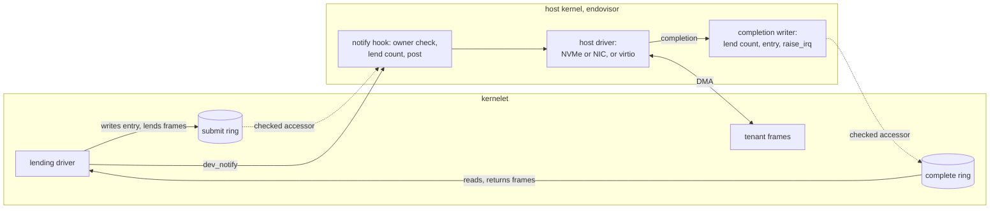
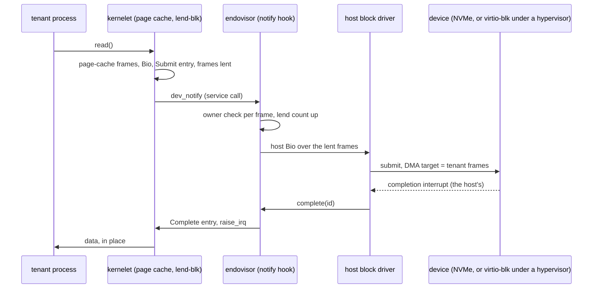
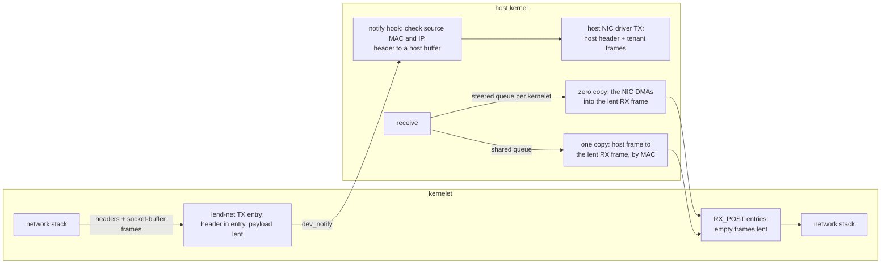
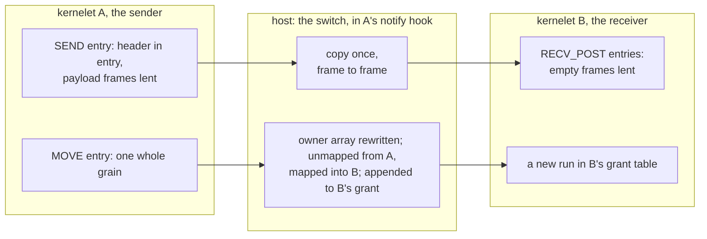

# Zero-copy I/O: the lending device model

*Cuts across questions 2 and 4. Specifies the second version of devices: a paravirtual device model built for kernelets rather than borrowed from virtio, whose block, network and inter-kernelet paths move data without copying it. The first version on the [Devices](virtualizing-ostd/devices.md) and [Channels](channels.md) pages stays as written. Every number says where it came from; the unit costs the argument rests on were measured on this book's host (an Intel Xeon E3-1270 v6, Linux 6.8; script and raw output in [I/O microbenchmarks](../../notes/io-microbenchmarks.md)) and are labeled **measured here**.*

## Where the time goes {#where-the-time-goes}

A kernelet today sees virtio devices. A virtio device is a pair of rings in the tenant's memory: the driver writes descriptors that point at buffers and notifies the device; the device fills or drains the buffers and writes a completion. In a microVM the notification is a **VM exit**, a hardware transition out of the guest that the hypervisor handles, and the device's work is done by a thread of the virtual machine monitor that copies data between the guest's buffers and the host's files or sockets. In the first version of kernelets the notification is a function call, but the rest has the same shape: a host **device thread** wakes, copies, and raises an interrupt.

What does a copy cost against the other things a request pays for? Measured here:

| what | cost | note |
|---|---|---|
| copying one 1,500-byte packet | 14 ns hot in cache | |
| copying one 4 KiB page | 33 ns hot; **457 ns cold** | cold is the realistic case for I/O data: 9 GB/s |
| copying 64 KiB | 1.2 µs hot; 6.4 µs cold | 10 GB/s cold |
| copying a 2 MiB grain | 61 µs hot; 156 µs cold | 13 GB/s cold |
| waking a thread on another CPU and being woken back | 5.8 µs round trip | **about 3 µs per wakeup** |
| unmapping one 4 KiB page while three other CPUs run this process | 2.9 µs; 4.0 µs for a protect-and-restore pair | a TLB shootdown, which any change of ownership pays |

Published: on 2013 hardware a VM exit and re-entry with the device emulation it triggers cost 3–10 µs, a device register access 1.2 µs when KVM handles it and 3.7 µs when a user-space monitor does, against 100–200 ns natively; a guest using the socket API reached about 1 million packets per second per core (Rizzo, Lettieri and Maffione, ANCS 2013). Firecracker's paper reports its block device at about 13,000 IOPS where the same hardware does 340,000 natively, because requests are handled serially on the monitor's thread, and its network at 44–46 Gbit/s to the host (Agache et al., NSDI 2020).

Two things follow. **For small requests the copy is noise**: 14 ns against a 3 µs wakeup or a 1–10 µs exit, so a "zero-copy" packet path that still wakes a thread per packet has saved nothing measurable. **For bulk the copy is the bill**: at 9–13 GB/s cold, one host core copies about 10 GB/s, so a sandbox moving 10 GB/s costs a core in copying alone. The metric this page optimizes is therefore **host CPU per request as a function of request size**: a fixed term (exits, wakeups, crossings, validation) plus a per-byte term (copies). The design attacks both, and [the argument](zero-copy-io.md#the-argument) is made for both.

## The idea {#the-idea}

A **lending device** is a device you lend frames to. Its rings live in the kernelet's memory like virtio's, and the host reads and writes them through the checked accessor the first version uses, so nothing is mapped read-write on both sides. What an entry carries is different: not addresses into some buffer, but a list of the kernelet's own **frames**, lent to the device for the life of one request. The host checks in constant time that each frame belongs to the kernelet, marks it lent, and hands its address straight to the host's own device driver as a DMA target. The physical device, or on a cloud host the hypervisor beneath the host's virtio driver, reads from or writes into the tenant's frame. When the device completes, the host marks the frames returned, writes a completion entry and raises the kernelet's interrupt line.



Three rules carry the design. **Lend**: a frame in flight is still the tenant's, but the tenant's kernel cannot free or reuse it, enforced twice ([lending](zero-copy-io.md#lending)). **Header in the entry**: the bytes the host must interpret travel inside the entry the host copies out once, never in a frame the tenant can rewrite under the host's feet. **No thread on the fast path**: submission happens in the notify call, bounded and without sleeping, and completion comes from the host driver's completion path; a device thread exists only for software backends that must sleep.

## Rings, entries and notifications {#rings}

A lending device has a **submit ring** and a **complete ring**, each a power-of-two array of fixed-size entries in the kernelet's grant, registered at attach with `dev_ring_set` and checked to lie in the grant as the first version checks virtio's queue addresses. The kernelet writes the submit ring and reads the complete ring; the host does the reverse; the counters each side publishes sit in its ring's first entry.

```rust
// ostd::kernelet::abi. Submit: kernelet-written, host-read through the accessor.
#[repr(C)] pub struct Submit {
    pub id: u32,          // the driver's request id, echoed in the completion
    pub op: u16,          // READ, WRITE, FLUSH, TX, RX_POST, SEND, RECV_POST, MOVE
    pub nseg: u16,        // frames lent, at most 16
    pub arg: u64,         // block: first sector; network: header length; channel: peer and port
    pub hdr: [u8; 128],   // network and channel: the headers, copied in by the driver
    pub seg: [Seg; 16],   // each inside one frame of the grant
}
#[repr(C)] pub struct Seg { pub paddr: u64, pub off: u16, pub len: u16 }
// Complete: host-written, kernelet-read.
#[repr(C)] pub struct Complete { pub id: u32, pub status: u16, pub _pad: u16, pub bytes: u64 }
```

Sixteen segments of one frame each make a request at most 64 KiB, which fits a segmentation-offload packet and the block requests the tree already splits at that size (checked on the tree: `bio.rs`, `max_nr_segments_per_bio`), and keeps the notify walk bounded.

**Notify.** `dev_notify(dev)` is a service call with no pointer, like every other ([service half](kernelet-api-service.md)). Under the device's lock and without sleeping, the hook reads new submit entries through the accessor, at most the ring's size of them, and for each: checks every segment's frame against the owner array (one load per frame), takes the frame's grain **lend count** up by one, and **posts the request to the host driver**: a block request becomes a host block request over the lent frames; a transmit becomes a host transmit whose first segment is the header copied out of the entry into a host-owned buffer, followed by the lent frames. If the host driver's queue is full the request waits in a per-device **inbox** of ring-size slots, preallocated at attach, and is posted when a completion frees a slot: the first version's inbox with the copy removed (register D50). The hook's worst case is one pass over a full ring, 256 entries and 4,096 owner checks, *estimated* at tens of microseconds; the driver holds its own lock for that long, as across a real notify, and the tree's drivers already batch their notifies (checked: `should_notify`).

**Complete.** The host driver's completion path calls the model's `complete(dev, id, status, bytes)`: it takes each lent grain's count down, writes a `Complete` entry through the accessor, and calls `Kernelet::raise_irq`, with a `Release` store ordering the entry before the line, the first version's ordering ([Interrupts and time](virtualizing-ostd/interrupts-and-time.md)). The kernelet's worker runs the driver's handler, which drains the ring.

**Interrupt suppression.** The submit ring's first entry holds a **polling bit** the kernelet writes. While it is set the host writes completions and raises nothing, and the driver's poll loop, run from the kernel proper's existing polling path (checked on the tree: `notify_poll_end` in the network trait), drains them. When the driver has drained the ring it clears the bit and re-reads the ring once, the standard race-free hand-off; the host, after writing a completion, reads the bit and raises the line only if it is clear. This is virtio's event index reduced to one bit, and it is what removes the per-request wakeup at high rates.

## Lending, and what enforces it {#lending}

A lent frame is still the tenant's: its processes may read and write it. What must not happen is that it **changes hands** while the device holds its address: freed and reallocated inside the kernelet, or returned to the host and granted to another tenant. Two independent mechanisms prevent this.

**In vOSTD, a type.** The driver turns each frame it lends into a `LentFrame`, which holds a reference to the frame's metadata as `Frame` does on the tree and lives in the driver's table of requests in flight; it is dropped only when the request's completion arrives. The kernel proper is `forbid(unsafe_code)` and gets frames back only through the driver, so no safe code can free a lent frame. This is what a memory-safe kernel gets for free: the rule Linux enforces with reference counts and driver discipline is a type here.

**In the host, a count.** The owner array gains a **lend count** per grain, a `u16` beside the owner, taken up in the notify hook after the owner check and down at completion. Anything that would move a grain out of the kernelet consults it: a grain with a nonzero count is not released, not moved by a channel, and not freed at destroy until the count is zero. Destroy waits for the device's outstanding requests, cancelling them in the host driver where it can; the kernelet is a `Zombie` for that long, the first version's rule for one I/O in flight ([Faults, termination, and reclamation](faults-and-reclamation.md)). The count is what protects other tenants if vOSTD is wrong: a compromised vOSTD can reuse its own lent frame and corrupt its own data, and cannot make the host grant that frame to anyone else while a device may still write it.

**What a tenant can do to a lent frame.** A process that rewrites a transmit buffer in flight sends what it wrote last, as `MSG_ZEROCOPY` on Linux does; a page written during writeback lands torn, as on every operating system with a page cache. Each effect stays inside the tenant. The one case where the host's correctness would depend on tenant memory is a header the host parses to make a switching decision, and that is why headers travel in the entry: the host parses bytes it copied, and the device transmits those same host-owned bytes.

**DMA safety.** The device writes into a frame only because an entry named it, the owner check passed, and host code posted it to a host-driven device; the tenant never programs the device. On bare metal the host's IOMMU domain protects against a faulty device and is not part of the tenant isolation argument; on a cloud host the hypervisor bounds every DMA to the host's memory. Under the density study's C13 the frame address would be a kernelet-physical address translated in the hook; nothing else on this page changes.

## Block {#block}

The kernelet's block layer already works in frames: a request is a `Bio` whose segments are page-cache frames wrapped as DMA streams (checked on the tree: `bio.rs`, `BioSegment::new_from_segment`). The `lend-blk` driver implements the same `enqueue` the virtio-blk driver does (checked: `device/block/device.rs`) but writes one `Submit` per bio: the sector, the operation, and the bio's frames as segments, each wrapped as a `LentFrame`. Nothing on the kernelet side is copied, which was already true; what the lending model removes is the host side.



**Two tiers of backend.** At **tier 2**, the hardware tier, the device is backed by an **extent** of a host block device: a partition, or a range list the endovisor resolves once at attach by asking the host file system for a file's blocks, refusing sparse or compressed files. The hook turns a submit entry into a host `Bio` over the lent frames and submits it to the host's block device, virtio-blk when the host is a cloud VM and NVMe on bare metal (the tree has both: `comps/virtio`, `comps/nvme`); the device DMAs into the tenant's page cache, and the host's own page cache is not involved. The one host change needed is assumption A14: a `BioSegment` over frames the host owns but did not allocate. At **tier 1**, the software tier, the backend is a host file as in the first version and the device thread stays: it reads the file into the lent frames with `read_at`, one copy from the host's page cache, and calls `complete`. Tier 1 is the first version minus the pinning accessor on the data path, kept for hosts without an extent-capable file system.

**Cost per 4 KiB read at tier 2**, *estimated* from the unit costs above: a crossing for the notify (the measured 35-cycle crossing plus dispatch, under 100 ns), an owner check and a lend-count update, the host's own block submission, which a native process pays too, and at completion one `raise_irq` and one worker wakeup, about 3 µs, or nothing under polling. Copies: zero. The same read in a microVM with a user-space monitor pays an exit for the notify, a monitor-thread wakeup, a `pread` copying 4 KiB cold from the host's page cache (457 ns), an interrupt injection and often an exit to acknowledge it.

## Network {#network}

The kernelet's stack hands the driver a packet and takes received packets back through the tree's device trait (checked: `aster_network::AnyNetworkDevice`, `send(&[u8])`, `receive() -> RxBuffer`). On the tree `send` copies the packet into a transmit buffer from a DMA pool (checked: `buffer.rs`, `TxBuffer::new` calls `copy_payload`). The `lend-net` driver adds one method, `send_frames(hdr: &[u8], frames: &[LentSeg])`, which the stack calls with the packet's headers and the socket buffer's frames, so that copy goes too. The user ABI is unchanged: a tenant's `write` still copies its bytes into the kernelet's socket buffer once, as on Linux without `MSG_ZEROCOPY`, and from there nothing copies.



**Transmit.** The driver writes the packet's Ethernet, IP and transport headers, up to 128 bytes, into the entry's `hdr` and the payload frames as segments. The hook copies the header out, checks that the source MAC is the device's and the source IP is one the sandbox was given, rewriting or dropping otherwise as the vsock switch does for CIDs ([Channels](channels.md)), prepends the offload header the host NIC wants (checksum and segmentation, which the tree's virtio-net driver already emits as `VirtioNetHdr`), and posts a transmit of two or more segments, host header first, to the host NIC driver: the host's virtio-net on a cloud host, the NIC driver on bare metal. The payload frames are the DMA source, unread by the host.

**Receive, two tiers.** A packet lands in the host's receive buffers first, and the tier depends on whether the tenant's frames can *be* those buffers. **Tier 2** needs a **per-kernelet receive queue**: a NIC that steers by destination MAC or VLAN to a queue of its own (a virtual function, or a filter per kernelet on a multi-queue NIC), or on a cloud host one virtio-net device per kernelet, which cloud NICs offer as multiple interfaces. Then the frames the kernelet lends with `RX_POST` are what the host driver posts to that queue, the device DMAs the packet into the tenant's frame, and the host completes the entry with the length: zero copies, and no host thread touched the packet. **Tier 1** is a shared queue: the host receives into its own frame, reads the destination MAC, finds the kernelet, copies the packet into that kernelet's next lent frame (14 ns for 1,500 bytes hot), completes it, and recycles its own frame. One copy, which the first section showed is one to three percent of a packet's fixed cost; the design does not call tier 1 receive zero-copy, and it does not need to.

**Cost per packet.** Transmit: one crossing and hook per batch, a header copy of at most 128 bytes, the host driver's post, and at completion a batched `raise_irq` or nothing under polling. Receive: the host driver's completion, a MAC lookup, a completion write, a batched `raise_irq`. No exits, and no user-space backend: the first version's two copies and two wakeups per frame through the runtime's NAT (register D25) are gone, which is what assumption A7 hoped for.

## Between kernelets {#between-kernelets}

The Channels page sends every inter-kernelet byte through a vsock switch that copies twice and hops through two device threads. The `lend-chan` device keeps the vsock socket layer and its credit rules and replaces the transport beneath it. A receiver lends empty frames with `RECV_POST`; a sender lends its payload frames with `SEND`, the connection in `arg` and the vsock header in `hdr`. The host's switch, in the sender's notify hook, validates the header as today, takes the receiver's next posted frame, **copies once, frame to frame**, and completes both entries. One copy and no device thread, against two copies and two threads. The copy is bounded by the entry's 64 KiB, 6.4 µs cold, the hook's worst case per entry.



For bulk there is a second operation, **MOVE**, the Channels page's ownership-transfer extension made concrete. The sender lends one whole grain, obtained by the kernel proper as a contiguous 2 MiB segment and filled, with no frame of it mapped to a process or lent elsewhere, which vOSTD asserts because it owns the metadata. The switch checks the grain's lend count is exactly this one, rewrites the owner array, clears the grain's 2 MiB entry in the sender's physical window and flushes the sender's CPUs, re-zeroes and moves the eight metadata frames, maps the grain into the receiver's window, and appends a one-grain run to the receiver's grant table with a `JOB_GRANT` notification, the receiver's `grains_request` path arriving unasked. The sender's grant shrinks and the receiver's grows: assumption A1 becomes "memory changes by whole grains, and every change is accounted", which the density study's C02 needs anyway. Cost, *estimated* from the measurements: one entry clear with a TLB shootdown, 2.9–4 µs; 32 KiB of metadata re-zeroed, about a microsecond; a few table writes; **under 10 µs per 2 MiB**, against 61–156 µs to copy it. The crossover with copying lies between 64 KiB (1.2–6.4 µs to copy) and 256 KiB, so the switch moves grains only for payloads of at least 1 MiB. A receiver at its `max_grains` gets the copy path instead.

## The argument {#the-argument}

The metric: host CPU per request, a fixed term plus a per-byte term. The first table counts what each path pays per request; the microVM rows are what the architecture requires, the kernelet rows are what this page specifies.

| per request | VM exits | thread wakeups | payload copies | source of the counts |
|---|---|---|---|---|
| microVM, user-space monitor (Firecracker's shape), block | 2–3 (notify, interrupt, acknowledge) | 1–2 (the monitor's thread; the vCPU if idle) | 1 (from the host page cache) | virtio's MMIO transport; Firecracker's paper |
| microVM, kernel `vhost` (network) | 1–2 | 1 (the vhost thread) | 1 | vhost's design: the notification still exits |
| microVM, polling backend (`vhost-user`, SPDK, DPDK) | 0 under load | 0 | 1, or 0 with a virtual function | the backend spins on a dedicated core |
| **kernelet, lending, interrupt-driven** | **0** | **1** (the worker, at completion) | **0** at tier 2; 1 at tier 1 | this page |
| **kernelet, lending, polling** | **0** | **0** | **0** at tier 2 | this page |

Unit costs: a VM exit 3–10 µs on 2013 hardware and, taking a tenfold improvement since, 0.5–2 µs today (assumption A15, **[unverified]**, consistent with the 2.5 µs an exit plus host fault cost inside a Firecracker guest in the density study); a wakeup about 3 µs measured here; a cold 4 KiB copy 457 ns.

| fixed term per request | microVM, user-space monitor | microVM, `vhost` | kernelet, interrupt-driven | kernelet, polling |
|---|---|---|---|---|
| exits | 1.5–6 µs | 0.5–4 µs | 0 | 0 |
| wakeups | 3–6 µs | 3 µs | 3 µs | 0 |
| crossing, validation, posting | inside the monitor's time | inside the vhost thread's time | 0.2–0.5 µs *estimated* | 0.2–0.5 µs |
| **total** | **5–12 µs** | **4–7 µs** | **3.5 µs** | **0.2–0.5 µs** |

The per-byte term is one cold copy for every microVM row but the virtual function, and none for the kernelet at tier 2: **0.1 core per GB/s**, nothing at a sandbox's usual rate and a whole core at 10 GB/s.

The claim, with its limits. **Per request, the lending model removes every VM exit and all but one thread wakeup, and with polling removes that too, without spending a core on a polling backend**, because the kernelet's own worker is the poller and runs only when the kernelet has work: about 1.5–3× less fixed cost than a user-space monitor and 1–2× less than `vhost` when interrupt-driven, and about 10× less when polling, on a metric where polling microVM backends reach the same place only by dedicating a host core per backend. **Per byte, at tier 2, it removes the host copy**, which matters above a few GB/s per sandbox and is what SPDK and DPDK exist to remove; the kernelet gets it without a user-space driver, because the host's frames are the tenant's frames. **What it does not claim**: to beat a polling `vhost-user` backend per request when that backend's core is free; that tier 1 receive is zero-copy; that the hook's 0.2–0.5 µs is measured; or anything about the kernel proper's own stack cost, the same on both sides and, by Rizzo's figure, where the next microsecond per packet lives.

## What a tenant sees {#tenant}

- The same `/dev/vda`, `eth0` and `/dev/vsock`, driven by `lend-blk`, `lend-net` and `lend-chan`; an image with the virtio drivers still runs against the first version's models, chosen per device at attach.
- Block latency is the device's plus one wakeup; under a queue depth the polling bit engages and the interrupt count in `/proc/interrupts` stops rising.
- At tier 2 the sandbox has a hardware receive queue and an address on the host's network, and the runtime's NAT is gone.

## Costs {#costs}

- Per device: two rings in the grant, the inbox, the host driver's queue entries the device may hold, bounded by the ring size; for tier 1 block, one device thread as in the first version.
- Per request: one crossing per notify batch, one owner check and lend-count update per frame, one host driver submission, one completion write, one `raise_irq` per completion batch or none under polling.
- Per grain of the host: two bytes for the lend count.
- Per `MOVE`: one page-table entry and one TLB shootdown on each side, 32 KiB of metadata re-zeroed, three table writes.
- Host changes, assumption A14: a borrowed-frame `BioSegment`; multi-segment transmits over borrowed frames, which the tree's virtio queue already takes (`add_dma_bufs` over slices); receive-queue steering where tier 2 network is wanted (A16); a `send_frames` method on the network device trait.

## What this page decides {#decides}

- **The second version's devices are lending devices: rings in the kernelet's memory read through the checked accessor, entries that lend the kernelet's own frames, host drivers that take those frames as DMA targets** (register D70). Keeping virtio and changing only the backend leaves the descriptor walk, the device thread and the copy in place; rings mapped read-write on both sides are below the isolation floor.
- **Headers travel in the entry; payloads stay in lent frames** (register D71).
- **Lending is enforced by a type in vOSTD and a per-grain lend count in the host; a lent grain is never released, moved or freed** (register D72).
- **Submission happens in the notify hook, bounded and non-sleeping, straight into the host driver; a device thread exists only for backends that sleep** (register D73).
- **Interrupt suppression is a polling bit the kernelet writes** (register D74).
- **Network receive is zero-copy only with a per-kernelet receive queue; a shared queue costs one host copy, stated as such** (register D75).
- **Inter-kernelet transfer copies once, frame to frame, in the sender's hook; whole grains move for payloads of at least 1 MiB; A1 becomes "memory changes by whole grains, accounted"** (register D76).

Sources for the published figures: L. Rizzo, G. Lettieri, V. Maffione, "Speeding up packet I/O in virtual machines", ANCS 2013; A. Agache et al., "Firecracker: lightweight virtualization for serverless applications", NSDI 2020; W. de Bruijn, E. Dumazet, "sendmsg copy avoidance with MSG_ZEROCOPY", netdev 2.1, 2017. Measured-here figures, with the script and raw output: [I/O microbenchmarks](../../notes/io-microbenchmarks.md) in The Notes.
