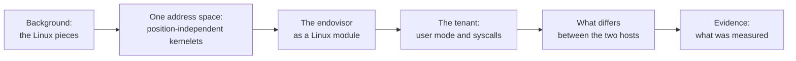

# Linux as the host

*A second host for the same kernelets. The Design chapter assumes the host kernel is Asterinas; this chapter asks whether Linux can host kernelets instead, answers yes, and says exactly what it costs. **No kernelet has been built or run, on either host.** What was built and measured here is the mechanism each claim turns on; every other Linux fact is cited to Linux's own source with a link. The chapter also changes one decision in the Design chapter, because the mechanism that makes Linux mode possible is better in both modes.*

## Why ask

vOSTD virtualizes an **API**, not a machine. A kernelet calls a table of functions and never touches hardware. Nothing in that arrangement says who implements the table. If the answer can be "Linux", two things follow.

**For the research.** The claim stops being *we built a second personality of our own kernel* and becomes *the boundary is the API, and the host beneath it is replaceable*. A mechanism that works on two unrelated kernels is a mechanism, not a coincidence.

**For adoption.** The objection to kernelets is not the idea; it is the deployment. Kernelets ask an operator to put a young kernel in the most privileged position on the machine. Linux mode removes that ask. An operator keeps the kernel they already run, and gains sandboxes whose kernel code is safe Rust. Asterinas mode remains the destination; Linux mode is the road.

## What this chapter concludes

Linux can host kernelets. Three things had to be true. Two were tested on a kernel built and booted for the purpose; the third is an argument from Linux's own interfaces, cited page by page:

1. **Many kernelets can share one kernel address space.** The Design chapter gives each kernelet its own kernel page table, because each is linked at fixed addresses. Linux cannot do that: its kernel half is shared by every process by construction. The fix is to make the kernelet image position-independent and load each instance at a different offset. One physical copy of the text serves every instance, and each instance's data is selected by the processor's own program-counter-relative addressing, with no register, no table and no lookup. This was [measured](evidence.md): four instances, one physical text page, each call returning its own instance's data.

2. **The tenant's system calls can reach the kernelet.** Linux offers an out-of-tree component no way to do this in the kernel, so the honest answer has two tiers. Without touching Linux, [Syscall User Dispatch](tenant.md) turns each tenant call into a signal and a short trip through user space, measured at **936 ns** against **46 ns** for a call Linux services itself. With a twenty-line patch adding a per-task hook, the same call costs **118 ns**, which is **7.9× cheaper**. Both were measured in the same guest in the same run.

3. **Everything else maps onto ordinary Linux.** Kernelet tasks are kernel threads, tenant memory is a virtual memory area whose fault handler is the kernelet's, grains are pages from Linux's allocator addressed through its direct map, and a virtual interrupt is a wakeup. None of this needs a patch, and none of it was built: this third point is argued from Linux's interfaces, not demonstrated.

One more thing is needed and is not negotiable: an out-of-tree module **cannot make memory executable at an address it chooses**. `vmap()` strips the execute permission, `execmem_alloc()` is not exported, and no permission setter is exported either. Linux mode therefore needs one exported symbol. The [evidence](evidence.md) page gives the one-line diff and the failure it fixes.

## What it costs, stated once

Linux mode is not free, and this chapter does not pretend otherwise:

- **A patch, or a slower path.** One line to export a symbol is required. The twenty-line syscall hook is optional and buys 7.9×.
- **Linux's own maturity is now in the trusted base.** The operator keeps their kernel, and keeps its bugs. Kernelets stop the tenant's *kernel* from being the attack surface; they do not make Linux smaller.
- **A different failure mode.** In Asterinas mode the host is ours and we can say what a stray kernelet pointer reaches. In Linux mode a kernelet runs inside a kernel with millions of lines it did not write.

## The road through this chapter

In this chapter:

- [Background: the Linux this chapter needs](background.md) — every Linux concept used later, defined before use, for a reader who has never worked on Linux.
- [One address space, many kernelets](one-address-space.md) — the position-independent scheme, why it is needed, what it costs, and the Design-chapter decision it replaces.
- [The endovisor as a Linux module](endovisor.md) — loading a kernelet, its memory, its tasks, its interrupts.
- [The tenant: user mode and system calls](tenant.md) — the hard part, its four candidate mechanisms, and the measured choice.
- [What differs between the two hosts](what-differs.md) — the item-by-item table, which is this chapter's central claim.
- [Evidence](evidence.md) — what was built, what was measured, and what is still argued rather than shown.
