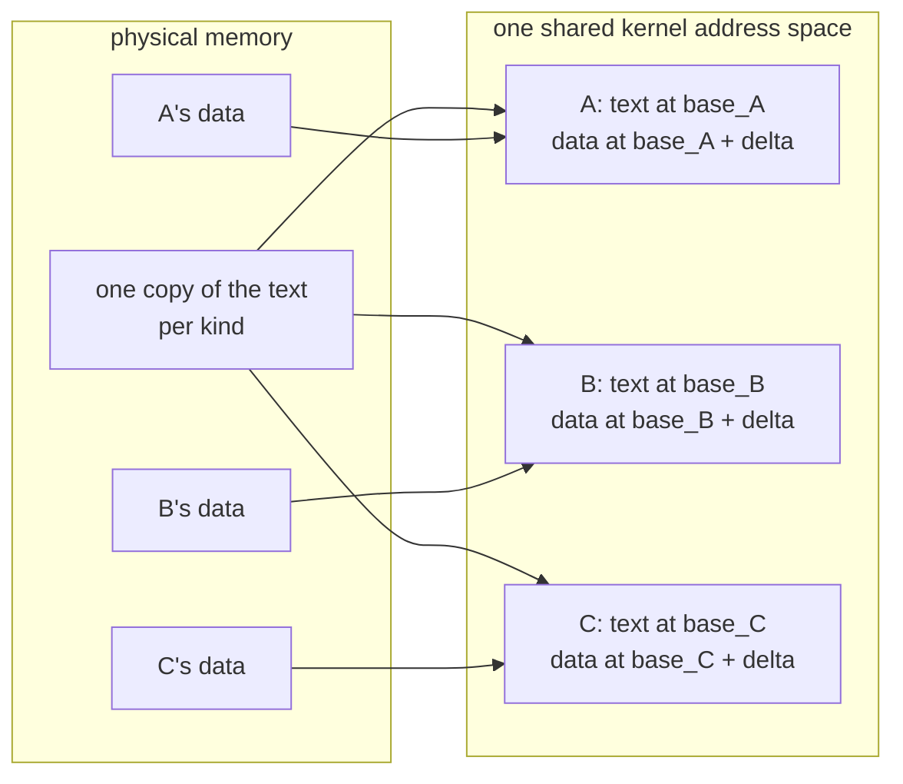

# One address space, many kernelets

*The mechanism that makes Linux mode possible. The Design chapter gives every kernelet its own kernel page table; Linux cannot. This page shows how to put every kernelet in one shared kernel address space instead, what that costs the trusted base, and what protection it gives up. The scheme is better in Asterinas mode too, so this page also replaces a Design-chapter decision.*

## The problem, stated exactly

A kernelet's image is linked at fixed addresses: its code at one address, its writable data at another, the same addresses in every kernelet ([Builds and images](../design/builds-and-images.md#window), and the [design register](../../notes/design-register.md), D3). Two kernelets therefore want the *same* virtual address to hold *different* data. The only way to grant both wishes is to give each kernelet its own page table, and that is what the Design chapter does: a kernelet's kernel page table is the host's, with two top-level entries swapped for its own.

Linux will not have it. Its kernel half is shared by every process by construction: one set of upper-half page-table entries, referenced from every process's page table, kept in step by the kernel itself. There is no supported way for a module to give one task a different kernel half, and no unsupported way that survives contact with Linux's own bookkeeping.

So on Linux, all kernelets must live in **one** kernel address space. The question is whether that can be made to work, and what it costs.

## The idea

Make the kernelet image **position-independent**: code that refers to things by *distance from itself* rather than by absolute address. Then the image has no fixed home, and the loader may put each instance wherever it likes.

That much is ordinary. The interesting part is what it does for the data.

A kernelet's image has two parts with opposite requirements. Its **code** is identical in every instance of a kind, and there may be thousands of instances, so we want exactly one physical copy. Its **data** — every global variable in vOSTD and in the kernel proper — must be private to each instance, or the kernelets are not separate kernels at all.

One copy of the code, many copies of the data. How does a shared instruction reach the right instance's variable?

**It already does.** Position-independent code on x86-64 names a variable by its distance from the currently executing instruction. Give each instance its own range, and keep its code and data at the same distance apart in every range. Then the identical instruction, executed through instance A's mapping, computes A's data, and executed through B's mapping, computes B's. The processor does the selection, from the program counter, for free.

The distance *delta* is the same in every instance. That is the whole trick.

It is not a new one. A shared library has had one text and per-process data since the 1980s; `dlmopen` gives several independent instances of one library, with independent data, inside one address space; and thread-local storage and Linux's own per-CPU variables solve the same problem by reserving a register. What is worth stating precisely is the difference: those mechanisms select the instance through a segment register or a table, and cost an extra load or an extra add on every access. Selecting it from the program counter costs nothing at all, because the address computation was going to happen anyway.

## Does it work?

The claim is small enough to test in eight bytes of machine code. Put one page of position-independent text in physical memory, containing a function that loads a value from the page that follows it. Map that one physical page four times, each time followed by a *different* data page. Then call through each mapping and see which value comes back.

It works. Four mappings, one physical text page, four different answers, each the right one. The transcript is on the [evidence](evidence.md) page.

## What is shareable, and what is not

The toy proves the addressing. It does not prove the thing the scheme actually rests on, which is that **the shared part of a real image carries no relocations**. If the loader had to patch the text for each instance, there could be no shared copy.

So that was measured too, on a Rust image built with the flags a kernelet image would use, containing the shapes a kernel is full of: tables of trait objects, of string slices, of function pointers.

| section | size | relocations inside | can it be shared? |
|---|---|---|---|
| `.text` | 274,307 B | **0** | yes |
| `.rodata` | 64,914 B | **0** | yes |
| `.data.rel.ro` | 4,192 B | 181 | no |
| `.got` | 952 B | 119 | no |

All 300 are of one type, the base-relative fixup, so the host's relocation loop has a single case. A C build of the same shapes adds one relocation in `.init_array`.

The result is better than the scheme needs: 98 percent of the read-only material is address-free and therefore shareable, and the part that must be copied and patched per instance is a few kilobytes. But it also corrects the first draft of this chapter, which had put `.init_array` in the shared region and had not mentioned `.data.rel.ro` or `.got` at all. Anything holding an address belongs on the private side, and the [build's audit](../design/builds-and-images.md#audit) now checks exactly that rather than checking which page-table entry the image lies under.

One consequence for Linux. `.data.rel.ro` is meant to be made read-only once its relocations are applied, which is a hardening measure Linux performs for its own modules. Doing it here needs `set_memory_ro`, which like `set_memory_rox` is not exported. Nothing breaks without it, so it is the second of the [three exports](evidence.md) a complete Linux mode wants, rather than the one it cannot start without.

## Two things the scheme must survive

**Indirect-branch tracking.** Recent x86-64 processors refuse an indirect call whose target is not a designated landing instruction, and Linux both enables this for its own code and rewrites indirect call sites into a stricter, per-signature form. The kernelet design is built on indirect calls: the service table vOSTD calls down through, and the entry table the host calls up through. So the question cannot be avoided, and it was [tested](evidence.md): the Rust compiler emits the landing instruction on request, at the cost of an unstable flag and of rebuilding the standard library with it. That is half an answer. The other half — whether a kernel that rewrites call sites can rewrite text that every instance of a kind shares — is untested, and is assumption A19. The toy on the evidence page passes only because the test processor predates the feature, and the [build audit](../design/builds-and-images.md#audit) gains a check for the markers. **[unverified]**

**Translation-buffer pressure.** Sharing the text physically does not share it in the translation buffer. On Linux the image is assembled with `vmap()`, which maps at the smallest page size only, so each instance holds its own small-page translations for text it shares with every sibling. The Design chapter's 2 MiB mapping of the image is therefore an Asterinas-mode property, not a property of the scheme. What this does to the density argument's per-instance overhead is not re-derived here. **[unverified]**

## Addressing physical memory

The image is only part of a kernelet. The larger part is the memory it has been granted, and vOSTD must turn a physical address into something it can dereference. In OSTD today that is one addition, `paddr_to_vaddr(pa) = pa + LINEAR_MAPPING_BASE_VADDR`, and the Design chapter preserves the shape by giving each kernelet a private window at a fixed address.

Under one shared address space the base can no longer be a compile-time constant, so the host supplies it at creation and the instance holds it in its own data. `paddr_to_vaddr` becomes a load from a line that is always hot, then an add. **The kernelet's code is the same either way**, which is what lets the two hosts differ underneath it.

What the base points at is the interesting question, and the two hosts answer it differently.

## The fail-stop property, and what it costs to keep

In the Design chapter the base points at a **private window that maps only this kernelet's grains**. That buys something beyond convenience: a physical address vOSTD miscomputes lands on an unmapped page and stops the kernelet, instead of quietly writing another tenant's memory. The same page keeps that property for frame metadata and says it is worth keeping.

The first draft of this chapter gave it up for grains without doing the arithmetic. Here it is.

A private window must span the physical range the kernelet can be granted. If the host confines a kernelet's grains to a bounded slice of physical memory, the window reserves that slice's size in address space:

| the kernelet's physical slice | address space per kernelet | kernelets in 32 TB (4-level vmalloc) | in 12.5 PB (5-level) |
|---|---|---|---|
| a 2 GiB slice | 2 GiB | about 16,000 | far more than wanted |
| a whole 1 TiB machine | 1 TiB | 32 | unusable |
| metadata window only, 2 GiB slice | 32 MiB | about 1,000,000 | no limit in practice |

So the property is affordable — at 2 GiB per kernelet, sixteen thousand of them fit in four-level paging's vmalloc area — **provided the host can confine each kernelet's grains to a bounded physical slice**. That is the condition, and it is where the two hosts part company.

- **Asterinas mode keeps the window.** The host owns its own frame allocator and can hand a kernelet grains out of a reserved slice, so it does, and the fail-stop property survives. The base in `BootArgs` points at the private window.
- **Linux mode uses the direct map.** Linux's page allocator offers no supported way to confine allocations to a physical slice, short of reserving memory at boot with the contiguous allocator and managing it ourselves, which is a larger design than this chapter wants to propose. So on Linux the base is `page_offset_base`, every frame on the machine is addressable, and **the fail-stop property is lost**.

This is a real difference between the hosts, it is the only one that touches a security property, and it is a row in the [what differs](what-differs.md) table rather than a footnote.

## Frame metadata

OSTD keeps a 64-byte record for every frame, found by arithmetic on the frame's physical address. Each kernelet gets its own metadata region at a base the loader chooses and writes into `BootArgs`, holding records only for its own frames. The formula stays OSTD's, with a per-instance base instead of a constant, and the region is sparse, so a miscomputed metadata address still meets an unmapped page and stops the kernelet. This holds on **both** hosts: the region is small enough (one byte per sixty-four of physical span) that even a machine-wide span costs 16 GiB of address space per kernelet, and a bounded slice costs 32 MiB.

## What it costs, honestly

**A relocation processor in the trusted base.** The loader must walk the image's relocation entries and patch each one. For a position-independent image these are all of one kind, a base-plus-offset fixup, and the loop is a few dozen lines. It is new trusted code, and the Design chapter's rejection of position-independence named exactly this cost. It was right to name it; what has changed is that we now get something for it.

**Kernelets become mutually addressable.** In the Design chapter a stray kernel pointer in kernelet A that happened to name kernelet B's image would fault, because B's image is not in A's page table. Under one address space it would not.

How much that matters depends on which host. A kernelet could always reach any frame *through the linear map*, so on Linux, where the base is the direct map, the change adds little to a reach that was already total. In Asterinas mode, where the window stays private, the shared image is now the one part of another kernelet that a stray pointer can name. Either way the security argument rests, as [Boundaries and trust](../design/principles.md) now says explicitly, on the kernel proper being safe Rust and vOSTD being correct.

**One physical copy of the text is one physical copy to corrupt.** This is the cost the first draft missed. The text of a kind is now a single set of frames that every instance of that kind is executing. On Linux, where every kernelet can address every frame, a sufficiently wrong write from one tenant's kernel rewrites the code all of its neighbors are running. The mitigation is to keep the text out of any writable alias — it is mapped read-only in the instances' ranges, and on Asterinas the host can map it read-only in the linear map as well; on Linux that needs `set_memory_ro`, the second unexported symbol. Until then it is a real and stated exposure, and it is strictly worse than mutual addressability, which is why it is listed second.

**The per-instance footprint has to be re-derived.** Assumption A4 puts a kernelet's fixed cost at about 128 KiB, and that figure was taken under the old scheme, where the image was one shared read-only mapping per kind and the per-instance cost was page tables and metadata. Under this scheme the per-instance cost is the writable segment plus the few kilobytes of relocated read-only data plus, on Linux, one small-page translation per page of image. The direction is favorable — no per-kernelet top-level page-table entries at all — but the number is not recomputed here, and A4 is marked as resting on the superseded scheme. **[unverified]**

**Randomized offsets are not a defense.** The loader may scatter instances, and should. It buys nothing against a kernelet that can read its own base, which every kernelet can. It is hygiene, not a boundary.

## What this replaces in the Design chapter

This scheme is better in Asterinas mode too. It removes two top-level page-table entries per kernelet and everything beneath them, removes the rule that the image's mappings cannot use global page-table entries and the translation refill that rule costs after every address-space switch, and removes the assumption that the machine's physical memory fits in a 512 GiB window. The Design chapter is changed accordingly, in this branch:

- **D3** becomes: the image is position-independent, and the loader places each instance at an offset of its choosing in the shared kernel address space; the shared regions carry no relocations, which the audit checks.
- **D58** becomes: `paddr_to_vaddr` adds a base the host supplies — a private window on Asterinas, the direct map on Linux — and frame metadata keeps a per-instance region on both.
- **A13**, that the machine's physical range fits the window's 512 GiB, is withdrawn.
- **A2**, about the refill cost of non-global window translations, is withdrawn in the form it was asked; the image's own mappings are still per-instance and still not global, so the question returns in a smaller shape and is recorded as such.
- [Builds and images](../design/builds-and-images.md), [Memory](../design/virtualizing-ostd/memory.md) and [Boundaries and trust](../design/principles.md) are edited to match, and invariant I3 drops from *checked by the page tables* to *trusted*.

A reader who wants the old scheme will find it in the register, marked superseded, with the reason.
