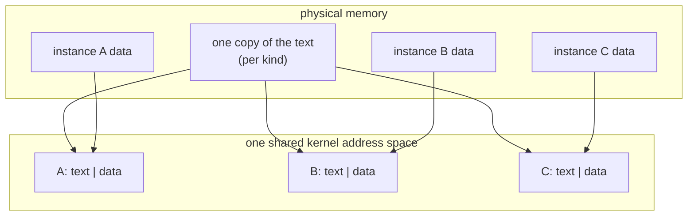

# One address space, many kernelets

*The mechanism that makes Linux mode possible. The Design chapter gives every kernelet its own kernel page table; Linux cannot. This page shows how to put every kernelet in one shared kernel address space instead, at a cost of eight bytes of machine code and one idea. The scheme is better in Asterinas mode too, so this page also replaces a Design-chapter decision.*

## The problem, stated exactly

A kernelet's image is linked at fixed addresses: its code at one address, its writable data at another, the same addresses in every kernelet ([Builds and images](../design/builds-and-images.md#window), register D3). Two kernelets therefore want the *same* virtual address to hold *different* data. The only way to grant both wishes is to give each kernelet its own page table, and that is what the Design chapter does: a kernelet's kernel page table is the host's, with two top-level entries swapped for its own.

Linux will not have it. Its kernel half is shared by every process by construction: one set of upper-half page-table entries, referenced from every process's page table, kept in step by the kernel itself. There is no supported way for a module to give one task a different kernel half, and no unsupported way that survives contact with Linux's own bookkeeping.

So on Linux, all kernelets must live in **one** kernel address space. Every kernelet's memory is addressable from every other. The question is whether that can be made to work, and what it costs.

## The idea

Make the kernelet image **position-independent**: code that refers to things by *distance from itself* rather than by absolute address. Then the image has no fixed home, and the loader may put each instance wherever it likes.

That much is ordinary. The interesting part is what it does for the data.

A kernelet's image has two parts with opposite requirements. Its **code** is identical in every instance of a kind, and there may be thousands of instances, so we want exactly one physical copy. Its **data** — every global variable in vOSTD and in the kernel proper — must be private to each instance, or the kernelets are not separate kernels at all.

One copy of the code, many copies of the data. How does a shared instruction reach the right instance's variable?

**It already does.** Position-independent code on x86-64 names a variable by its distance from the currently executing instruction. If instance A's image sits at one address and instance B's at another, and each image keeps its code and data at the same distance apart, then the identical instruction, executed through A's mapping, computes A's data, and executed through B's mapping, computes B's. The processor does the selection, from the program counter, for free.



No register is reserved, no table is consulted, no pointer is chased. The instruction that reads a global in the kernel proper is the same instruction it would have been in the Design chapter's scheme.

## Does it actually work?

The claim is small enough to test in eight bytes of machine code. Put one page of position-independent text in physical memory, containing a function that loads a value from the page that follows it. Map that one physical page four times, each time followed by a *different* data page. Then call through each mapping and see which value comes back.

It works. Four mappings, one physical text page, four different answers, each the right one. The full transcript is on the [evidence](evidence.md) page:

```
picdemo: one text page, pfn 0x76d
picdemo: instance 0 image at ffffc9000001d000  data at ffffc9000001e000  text pfn 0x76d
picdemo: instance 3 image at ffffc9000002d000  data at ffffc9000002e000  text pfn 0x76d
picdemo: call through instance 0 returned 0xda7a0000 (want 0xda7a0000) ok
picdemo: call through instance 3 returned 0xda7a0003 (want 0xda7a0003) ok
picdemo: RESULT PASS
```

## Addressing physical memory

The image is only part of a kernelet. The larger part is the memory it has been granted, and vOSTD must turn a physical address into something it can dereference. On the tree that is one addition, `paddr_to_vaddr(pa) = pa + LINEAR_MAPPING_BASE_VADDR`, and the Design chapter preserves the shape by giving each kernelet a private window at a fixed address.

Under one shared address space the private window is gone, and the answer is simpler than what it replaces: **use the host's own linear map**. Linux's direct map already holds every byte of physical memory, in order, and Linux's own `__va()` is the same single addition. The base is not a compile-time constant, so the loader writes it into the instance's data at load time, and `paddr_to_vaddr` reads it from there — one load from a line that is always hot, then one add.

This gives a kernelet the ability to address every physical frame on the machine. It is worth being precise that **this is not a change**. The Design chapter already shares the host's linear map into every kernelet's page table and says so plainly: *"sharing the linear map into a kernelet's page tables means vOSTD can address every physical frame: invariant I2's write confinement rests on that code's discipline, and the page tables back only the host-to-kernelet direction of privacy."* The window was never a wall between kernelets. It was a convenient base constant.

## Frame metadata, which does change

OSTD keeps a 64-byte record for every frame, found by arithmetic on the frame's physical address. The Design chapter gives each kernelet a private metadata window holding records only for its own frames, so that a miscomputed address lands on an unmapped page and stops the kernelet, rather than corrupting somebody's records.

That property is worth keeping, and it survives: the loader gives each instance its own metadata region at a base of the loader's choosing, written into the instance's data beside the linear-map base. The formula stays the tree's, with a per-instance base instead of a constant.

What it costs is address space. The region must span the physical range the kernelet can be granted, divided by 64. The arithmetic:

| the kernelet's physical span | address space per kernelet | kernelets in 32 TB (4-level) | in 12.5 PB (5-level) |
|---|---|---|---|
| a whole 1 TiB machine | 16 GiB | about 2,000 | far more than wanted |
| a 2 GiB slice | 32 MiB | about 1,000,000 | no limit in practice |

Reading this table the right way: on a machine using five-level paging, nothing constrains us. On four-level paging, either the host confines each kernelet's grains to a bounded slice of physical memory — which it has every reason to do anyway — or density is capped in the low thousands. The chapter states this rather than hiding it, and the [what differs](what-differs.md) page records it as the one place where the host's paging configuration reaches the design.

## What it costs, honestly

**A relocation processor in the trusted base.** The loader must walk the image's relocation entries and patch each one. For a position-independent image these are all of one kind, a base-plus-offset fixup, and the loop is a few dozen lines. It is new trusted code, and the Design chapter's rejection of position-independence named exactly this cost. It was right to name it; what has changed is that we now get something for it.

**Text must carry no relocations.** The whole scheme depends on one physical copy of the code serving every instance, so nothing in the code may be patched per instance. Only the data segment may have relocations. The build must check this, and the [evidence](evidence.md) page lists it among the audit's obligations.

**Kernelets become mutually addressable.** In the Design chapter, a stray kernel pointer in kernelet A that happened to name kernelet B's window would fault, because B's window is not in A's page table. Under one address space it would not. As the section above showed, A could already reach B through the shared linear map, so this removes a backstop that only ever caught a narrow class of accident. But it does remove it, and the security argument now rests, with nothing behind it, on the kernel proper being safe Rust and vOSTD being correct — which is what [Boundaries and trust](../design/principles.md) already says it rests on.

**Randomized offsets are not a defense.** The loader may scatter instances, and should. It buys nothing against a kernelet that can read its own linear-map base, which every kernelet can. It is hygiene, not a boundary.

## What this replaces in the Design chapter

This scheme is better in Asterinas mode too. It removes two top-level page-table entries per kernelet and everything beneath them, removes the rule that the window cannot use global page-table entries and the translation refill that rule costs on every address-space switch, and removes the assumption that the machine's physical memory fits in a 512 GiB window. The Design chapter is changed accordingly, in this branch:

- **Register D3** becomes: the kernelet image is position-independent, and the loader places each instance at an offset of its choosing in the shared kernel address space. The former text, which linked every kind at the same fixed addresses, is superseded.
- **Register D58** becomes: `paddr_to_vaddr` uses the host's linear map, whose base each instance holds; frame metadata keeps its per-instance region at a loader-chosen base. The two-entry kernelet window is superseded.
- **Assumption A13**, that the machine's physical range fits the window's 512 GiB, is withdrawn: there is no window to outgrow.
- [Builds and images](../design/builds-and-images.md) and [Memory](../design/virtualizing-ostd/memory.md) are edited to match, and [Boundaries and trust](../design/principles.md) gains the sentence about kernelets being mutually addressable.

A reader who wants the old scheme will find it in the register, marked superseded, with the reason.
