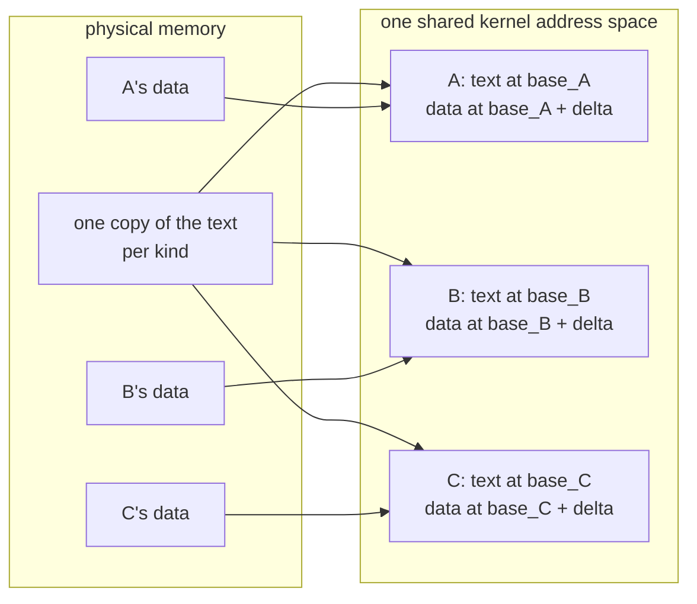

# One address space, many kernelets

*The mechanism that makes Linux mode possible. The Design chapter gives every kernelet its own kernel page table; Linux cannot. This page shows how to put every kernelet in one shared kernel address space instead, what that costs the trusted base, and what protection it gives up. The scheme is better in Asterinas mode too, so this page also revises two Design-chapter decisions and withdraws two assumptions.*

## The problem, stated exactly

A kernelet's image is linked at fixed addresses: its code at one address, its writable data at another, the same addresses in every kernelet ([Builds and images](../design/builds-and-images.md#window), and the [design register](../../notes/design-register.md), D3). Two kernelets therefore want the *same* virtual address to hold *different* data. The only way to grant both wishes is to give each kernelet its own page table, and that is what the Design chapter does: a kernelet's kernel page table is the host's, with two top-level entries swapped for its own.

Linux will not have it. Its kernel half is shared by every process by construction: one set of upper-half page-table entries, referenced from every process's page table, kept in step by the kernel itself. There is no supported way for a module to give one task a different kernel half, and no unsupported way that survives contact with Linux's own bookkeeping.

So on Linux, all kernelets must live in **one** kernel address space. The question is whether that can be made to work, and what it costs.

## The idea

Make the kernelet image **position-independent**: code that refers to things by *distance from itself* rather than by absolute address. Then the image has no fixed home, and the loader may put each instance wherever it likes.

That much is ordinary. The interesting part is what it does for the data.

A kernelet's image has two parts with opposite requirements. Its **code** is identical in every instance of a kind, and there may be thousands of instances, so we want exactly one physical copy. Its **data** — every global variable in vOSTD and in the kernel proper — must be private to each instance, or the kernelets are not separate kernels at all.

One copy of the code, many copies of the data. How does a shared instruction reach the right instance's variable?

**It already does.** Position-independent code on x86-64 names a variable by its distance from the currently executing instruction. Give each instance its own range, and keep its code and data at the same distance apart in every range. Then the identical instruction, executed through instance A's mapping, computes A's data, and executed through B's mapping, computes B's. The processor does the selection, from the program counter, for free.

The distance *delta* is the same in every instance. That is the whole trick.

It is not a new one. A shared library has had one text and per-process data since the 1980s; `dlmopen` gives several independent instances of one library, with independent data, inside one address space; and thread-local storage and Linux's own per-CPU variables solve the same problem by reserving a register. What is worth stating precisely is the difference: those mechanisms select the instance through a segment register or a table, and cost an extra load or an extra add on every access. Selecting it from the program counter costs nothing at all, because the address computation was going to happen anyway.

## Does it work?

The claim is small enough to test in eight bytes of machine code. Put one page of position-independent text in physical memory, containing a function that loads a value from the page that follows it. Map that one physical page four times, each time followed by a *different* data page. Then call through each mapping and see which value comes back.

It works. Four mappings, one physical text page, four different answers, each the right one. The transcript is on the [evidence](evidence.md) page.

## What is shareable, and what is not

The toy proves the addressing. It does not prove the thing the scheme actually rests on, which is that **the shared part of a real image carries no relocations**. If the loader had to patch the text for each instance, there could be no shared copy.

So that was measured too, on a Rust image built with the flags a kernelet image would use, containing the shapes a kernel is full of: tables of trait objects, of string slices, of function pointers.

| section | size | relocations inside | can it be shared? |
|---|---|---|---|
| `.text` | 274,307 B | **0** | yes |
| `.rodata` | 64,914 B | **0** | yes |
| `.data.rel.ro` | 4,192 B | 181 | no |
| `.got` | 952 B | 119 | no |

All 300 are of one type, the base-relative fixup, so the host's relocation loop has a single case. A C build of the same shapes adds one relocation in `.init_array` and one in `.data`.

The result is better than the scheme needs: 98 percent of the read-only material is address-free and therefore shareable, and the part that must be copied and patched per instance is a few kilobytes. The rule it establishes is simple and is what the [build's audit](../design/builds-and-images.md#audit) now checks: anything holding an address belongs on the private side, whatever section it is in. `.init_array` and `.got` are easy to overlook, and they hold addresses.

One consequence for Linux. `.data.rel.ro` is meant to be made read-only once its relocations are applied, which is a hardening measure Linux performs for its own modules. Doing it here needs `set_memory_ro`, which like `set_memory_rox` is not exported. Nothing breaks without it, so it is one of the [exports](evidence.md) a complete Linux mode wants, rather than one of the pair it cannot start without.

## Two things the scheme must survive

**Indirect-branch tracking.** The design is indirect calls: the service table vOSTD calls down through, and the entry table the host calls up through. Recent x86-64 processors refuse an indirect call whose target is not a designated landing instruction, so the image must carry one at every such target. That half was [tested](evidence.md): the Rust compiler emits them on request, at the cost of an unstable flag and of rebuilding the standard library with it. The toy on the evidence page passes only because the test processor predates the feature, and the [build audit](../design/builds-and-images.md#audit) gains a check.

The other half depends on which kernel, and the distinction matters more than the first draft of this page allowed.

On an ordinary kernel the hardware check is all there is, and emitting the markers is enough. On a kernel built with the compiler-enforced scheme, Linux goes further at boot: it rewrites every function's preamble and every indirect call site into a matched pair that compares a hash of the function's *type* before jumping. Two consequences follow, and neither is the one this page previously worried about.

The rewrite is **address-independent** — it encodes a type, not an address — so rewriting the single shared copy of a kind's text once, before publishing it, serves every instance. That question is answered.

What is genuinely open is harder. The rewrite is driven by tables a separate build-time tool produces for the kernel's own objects and which a Rust image does not have; the functions that apply it are not exported; the hash is re-seeded at each boot, so a kernelet's preambles would have to be rewritten with the running kernel's seed at load time; and the endovisor's own call *into* the entry table is itself a checked call site, so a kernelet's entry functions need preambles whose hashes match what the host's compiler computed for the C prototype. On such a kernel the design does not merely lose a hardening property: the first call into a kernelet traps. This is assumption A19, and it is the narrowest place where Linux mode might simply not work. **[unverified]**

**Translation-buffer pressure.** Sharing the text physically does not share it in the translation buffer. On Linux the image is assembled with `vmap()`, which maps at the smallest page size only, so each instance holds its own small-page translations for text it shares with every sibling. The Design chapter's 2 MiB mapping of the image is therefore an Asterinas-mode property, not a property of the scheme. What this does to the density argument's per-instance overhead is not re-derived here. **[unverified]**

## Addressing physical memory

The image is only part of a kernelet. The larger part is the memory it has been granted, and vOSTD must turn a physical address into something it can dereference. In OSTD today that is one addition, `paddr_to_vaddr(pa) = pa + LINEAR_MAPPING_BASE_VADDR`, where the base is a compile-time constant.

Under one shared address space it cannot be, so the host supplies it at creation in [`BootArgs`](../design/kernelet-api-control.md) and the instance holds it in its own data. `paddr_to_vaddr` becomes a load from a line that is always hot, then an add. **The kernelet's code is the same either way**, which is what lets the two hosts differ underneath it: the base is Asterinas's linear map on one and Linux's direct map on the other, and nothing above `paddr_to_vaddr` knows which.

What that base points at is the question a reader expects to divide the two hosts, and it does not.

## Where a miscomputed physical address lands

The Design chapter already made this choice, and made it the same way on both hosts. Decision D58 addresses granted frames through **the host's own linear map**, and [Memory](../design/virtualizing-ostd/memory.md) is explicit that a grain is mapped nowhere else and costs the host no page-table work per grain. A per-instance physical window was considered there and rejected, because it reserves address space in proportion to the machine's physical memory for every kernelet. [Boundaries and trust](../design/principles.md) draws the consequence in invariant I2: vOSTD is trusted with no second layer, and a wrong physical address is a write to whatever lies there.

So **grain addressing is not a place where the hosts differ.** It is fail-stop on neither. What Asterinas retains is the *option*: a host that owns its own frame allocator could confine a kernelet's grains to a bounded slice and map only that, at the address-space cost D58 declined to pay. Linux does not offer the option at all, because its page allocator has no supported way to confine allocations to a physical range. That is a difference in what could be built later, not in what either host does today.

## Frame metadata, which is the check that is left

One hardware check does survive, and it is the one invariant I3 now rests on. Each kernelet has its own **metadata region**, holding a 64-byte record for each frame it has been granted, found by the same arithmetic OSTD uses, over a per-instance base. The region is **sparse**: only the pages covering frames this kernelet actually holds are mapped. A metadata address computed from a frame the kernelet was never granted therefore meets an unmapped page and stops it.

Sparseness is what makes this affordable, because the region's address span is fixed by the physical span the kernelet's grains may touch — one byte of address for every sixty-four of physical memory.

| physical span a kernelet's grains may touch | metadata address space per kernelet | kernelets in 32 TB (4-level vmalloc) | in 12.5 PB (5-level) |
|---|---|---|---|
| a bounded 2 GiB slice | 32 MiB | about 1,000,000 | no limit in practice |
| a whole 1 TiB machine | 16 GiB | about 2,000 | about 800,000 |

Those figures are what the **flat** index costs, and the flat index is superseded. Decision D86 finds a frame's record through a two-level index over a coarse physical section, which sizes the region by policy rather than by the machine and moves the four-level bound to about sixty thousand per TiB of span, on both hosts. The table is kept because it is what the flat index would have cost, and because it is the arithmetic that motivated D86.

Read the second row for Linux, since Linux mode cannot bound the slice: **on a 1 TiB machine with four-level paging, the metadata regions alone cap a host at a few thousand kernelets.** Five-level paging removes the cap. This is the sharpest number in the chapter and it is arithmetic over the region sizes in Linux's documentation, not a measurement. **[unverified]**

And the region is harder to build on Linux than the [endovisor page](endovisor.md)'s one-line description suggests. `vmap()` maps a fixed array of pages densely at an address of its own choosing: it cannot leave holes, and it cannot be extended when the kernelet is granted more memory, because re-mapping elsewhere would invalidate every metadata pointer the kernelet holds. A sparse, growable kernel range needs a reserved address range that is populated later — `get_vm_area` followed by `apply_to_page_range`. The second of those is exported and the first is not, so **keeping I3's remaining check on Linux costs a fourth exported symbol.** Without it the region must be dense, which on a machine-wide span means gigabytes of real memory per kernelet, and that is not a trade anyone would take.

## What it costs, honestly

**A relocation processor in the trusted base.** The loader must walk the image's relocation entries and patch each one. For a position-independent image these are all of one kind, a base-plus-offset fixup, and the loop is a few dozen lines. It is new trusted code, and the Design chapter's rejection of position-independence named exactly this cost. It was right to name it; what has changed is that we now get something for it.

**Kernelets become mutually addressable.** In the Design chapter a stray kernel pointer in kernelet A that happened to name kernelet B's image would fault, because B's image is not in A's page table. Under one address space it would not.

It adds less than it appears to, on either host. A kernelet could already reach any frame through the linear map, so what is new is only that another instance's *image* can be named as well as its frames. The security argument rests, as [Boundaries and trust](../design/principles.md) now says explicitly, on the kernel proper being safe Rust and vOSTD being correct.

**One physical copy of the text is one physical copy to corrupt.** The text of a kind is now a single set of frames that every instance of that kind is executing. On Linux, where every kernelet can address every frame, a sufficiently wrong write from one tenant's kernel rewrites the code all of its neighbors are running. The mitigation is to keep the text out of any writable alias — it is mapped read-only in the instances' ranges, and the host can map it read-only in the linear map as well; on Linux that needs `set_memory_ro`, the second of the [symbols](evidence.md) that are not exported. Until then it is a real and stated exposure, and it is strictly worse than mutual addressability, which is why it is listed second.

**The per-instance footprint has to be re-derived.** Assumption A4 puts a kernelet's fixed cost at about 128 KiB, and that figure was taken under the old scheme, where the image was one shared read-only mapping per kind and the per-instance cost was page tables and metadata. Under this scheme the per-instance cost is the writable segment plus the few kilobytes of relocated read-only data plus, on Linux, one small-page translation per page of image. The direction is favorable — no per-kernelet top-level page-table entries at all — but the number is not recomputed here, and A4 is marked as resting on the superseded scheme. **[unverified]**

**Randomized offsets are not a defense.** The loader may scatter instances, and should. It buys nothing against a kernelet that can read its own base, which every kernelet can. It is hygiene, not a boundary.

## What this replaces in the Design chapter

This scheme is better in Asterinas mode too. It removes two top-level page-table entries per kernelet and everything beneath them, removes the rule that the image's mappings cannot use global page-table entries and the translation refill that rule costs after every address-space switch, and removes the assumption that the machine's physical memory fits in a 512 GiB window. The Design chapter is changed accordingly, in this branch:

- **D3** becomes: the image is position-independent, and the loader places each instance at an offset of its choosing in the shared kernel address space; the shared regions carry no relocations, which the audit checks.
- **D58** is unchanged in substance and clarified in wording: `paddr_to_vaddr` adds the host's linear-map base, which the host supplies at creation instead of the compile-time constant it was, and frame metadata keeps a sparse per-instance region on both hosts.
- **A13**, that the machine's physical range fits the window's 512 GiB, is withdrawn.
- **A2**, about the refill cost of non-global window translations, is withdrawn in the form it was asked; the image's own mappings are still per-instance and still not global, so the question returns in a smaller shape and is recorded as such.
- [Builds and images](../design/builds-and-images.md), [Memory](../design/virtualizing-ostd/memory.md) and [Boundaries and trust](../design/principles.md) are edited to match, and invariant I3 drops from *checked by the page tables* to *trusted, with the metadata region as its one remaining hardware check*.

The decisions are in the [design register](../../notes/design-register.md), where a reader who wants the old scheme will find it marked superseded, with the reason.

