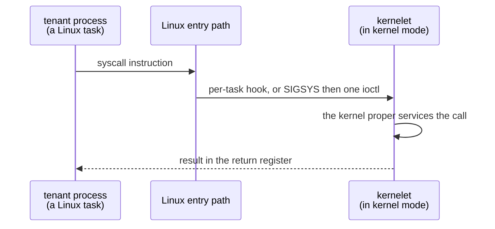

# The tenant: user mode and system calls

*The hardest part of Linux mode. A kernelet must run its tenant's programs and answer their system calls, and Linux gives an out-of-tree component no way to do either directly. This page works through what Linux does offer, measures the candidates, and picks two: one that needs no patch and one that is 7.9× faster and needs twenty lines.*

## Why this is hard

In Asterinas mode the answer is short. vOSTD calls `user_run`, the host switches to the tenant's address space and returns to user mode, and when the tenant makes a system call the host returns from `user_run` with the reason ([User mode](../design/virtualizing-ostd/user-mode.md)). The host is ours; we wrote the entry path.

On Linux neither half of that is available.

**A kernel thread cannot return to user mode.** Linux's return path restores the registers of the *current task* and runs on whatever page table Linux installed for that task's address space. A kernel thread has no user-mode side at all. There is no hook to substitute a page table on the way out, and the only in-tree machinery that runs code under a page table of someone else's choosing is the hypervisor.

**No module can intercept a task's system calls.** Linux diverts a call in exactly three places, and all three are driven from user space. There is no callback a module can register. The system-call table is read-only after boot and unexported.

## The shape of the answer

Since the kernelet cannot create a user-mode context, it borrows one: **the tenant's processes are Linux processes**. Linux schedules them, enters and leaves them, and handles their traps, exactly as for any program. What changes is who answers their system calls and who supplies their memory.

Memory is the easier half and needs no patch at all. The endovisor gives the tenant's address space a **virtual memory area whose fault handler is the kernelet's**. When the tenant touches an address, Linux calls that handler, and the kernelet supplies a frame out of its own grant. This is the ordinary mechanism a device driver uses to hand memory to a program, and it makes the kernelet the owner of its tenant's memory without fighting Linux for it.

System calls are the hard half, and there are four candidates.

## The four candidates, measured

All four were measured. Three need no kernel change; the fourth is the patch. Two machines were used, and the tables below are kept apart so that nothing is compared across them.

Measured in the **guest**, where a call Linux services itself costs 46 ns:

| mechanism | per call | needs a patch | what happens |
|---|---|---|---|
| a call Linux services itself | 46 ns | — | the floor |
| **Syscall User Dispatch** | **936 ns** | no | `SIGSYS` to a stub in the tenant, one call into the endovisor |
| **per-task hook** | **118 ns** | 20 lines | the entry path calls the kernelet directly |

Measured on the **build host**, where the floor is 485 ns, for the two candidates this chapter rejects:

| mechanism | per call | against Syscall User Dispatch on the same machine |
|---|---|---|
| Syscall User Dispatch | 1,887 ns | — |
| seccomp user notification | 5,721 ns | 3.0× more |
| `ptrace(PTRACE_SYSEMU)` | 8,221 ns | 4.4× more |

The two machines are never compared against each other; each table stands on its own. What carries across both is the shape: **not patching costs about twenty bare system calls per tenant call; patching costs about two and a half.**

Two candidates fall away immediately. Both seccomp user notification and ptrace put the answer in a *different process*, so each tenant call becomes a pair of context switches to a supervisor and back. On the same machine they cost three to four times what Syscall User Dispatch costs, and they are structurally worse, since a supervisor process is one more thing to schedule, account and keep alive.

## The no-patch path: Syscall User Dispatch

Syscall User Dispatch lets a process ask Linux to stop executing its system calls and raise a signal instead, with a single byte in the process's own memory deciding whether the diversion is on. Its intended users are Windows emulators, which must run a foreign program's calls themselves — which is very nearly what a kernelet does.

In Linux mode the sandbox is set up like this. The kernelet runtime starts the tenant's first process with a small **stub** mapped into it, outside the dispatch region so the stub's own calls run normally. The stub arms dispatch and sets the selector byte to *block*. From then on:

1. the tenant executes a system call; Linux raises `SIGSYS` instead of running it;
2. the stub's handler makes one call into the endovisor, carrying the register set;
3. the endovisor hands it to the kernelet, which services it and returns a result;
4. the stub writes the result into the signal frame and returns; the tenant resumes.

The cost is the 936 ns in the table, which is 890 ns more than a call Linux services itself: a signal delivered and returned from, plus one call into the module. The tenant's own kernel code — the kernel proper, doing the actual work of the system call — costs whatever it costs, on both sides of the comparison.

**What this path cannot do.** A signal is delivered on the tenant's own stack, so the stub needs a guaranteed stack, and a tenant that deliberately corrupts its own signal state breaks only itself. More seriously, the tenant can see the stub and the selector byte, because they are in its address space. That is acceptable: the tenant is *inside* the sandbox and is assumed hostile to its own kernelet only in the sense that any program is hostile to its own kernel. It cannot use the selector to escape, because turning dispatch off means its calls go to *Linux*, with the tenant's own unprivileged credentials, which is exactly the confinement the runtime set up with Linux's own facilities.

## The patched path: a per-task hook

The patch adds one field to the task structure and one check at the top of the system-call path: if this task has a kernelet, call it and skip Linux's dispatch. With the module's setter it is twenty lines across four files, given in full on the [evidence](evidence.md) page.

Measured at **118 ns** against 46 ns for a call Linux services itself, so reaching the kernelet and returning costs about 72 ns end to end. That covers the load and the branch on Linux's entry path, the indirect call, the toy servicer's own work and the return; the measurement does not separate them. Against the 936 ns of the no-patch path it is **7.9× cheaper**.

**Would it be accepted upstream?** Honestly, probably not as written. It adds a per-task function pointer that lets out-of-tree code take over a task's system calls, and that is close to what Linux's maintainers have historically pushed back on. A version with a better chance would be framed as a generalization of Syscall User Dispatch — an in-kernel dispatch target rather than a signal — and would come with an in-tree user. The chapter's position is that the patch is *small, measurable and optional*: an operator who will not patch gets the 936 ns path and everything else in this chapter unchanged.

## What the tenant's kernel actually does

Worth saying plainly, because it is easy to lose: in both paths the kernelet is doing the real work. The number above is only the cost of *reaching* it. The system call itself — resolving a path, reading from the page cache, extending a mapping — is the kernel proper's code, the same safe Rust that runs in Asterinas mode, operating on the kernelet's own memory. Linux's role ends at delivery.

## What this page decides

- **The tenant's processes are Linux processes, and the kernelet owns their memory through a fault handler on their virtual memory areas** (register D78). The alternative, a kernelet-built address space entered from a kernel thread, is not possible on Linux.
- **The tenant's system calls reach the kernelet through Syscall User Dispatch where Linux is unmodified, and through a per-task hook where the twenty-line patch is accepted** (register D79). Seccomp user notification and ptrace are rejected on measurement: both put the answer in another process and, on the same machine, cost three to four times what Syscall User Dispatch costs.
