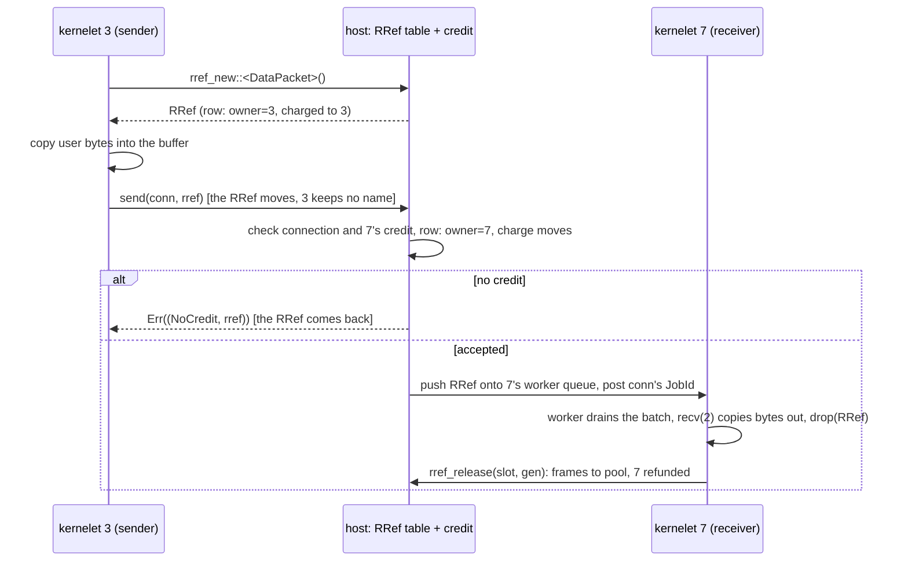

# The table, the transfer, and the accounting

The host keeps an **RRef table**: one row per live buffer, holding the owner `KerneletId`, a generation, the buffer's frames, its size, and a state. `rref_new` allocates the frames from a host pool and charges them to the caller's **channel account**; `send` over a vsock connection updates the row's owner to the peer and moves the charge with it, so that the shared-heap total is conserved across transfers; `rref_release` (the `Drop`) returns the frames to the pool and refunds the owner.

Receiver credit, from Alternative A, sits on top: a receiver posts credit (bytes and items) for a connection, charged to the receiver at posting time; a `send` without credit is refused and the `RRef` comes back in the error, which is why the signature returns it. That is what stops a perfectly typed, perfectly authorized sender from filling a neighbor's account; in a model without it, four 1 KiB sends into a 4 KiB tenant did exactly that.

The transfer itself is Alternative B's synchronous path: `send` is one function call that validates the connection, checks credit, updates the row, and pushes the `RRef` onto the receiver's **per-worker lock-free queue**, then posts the connection's `JobId` to the receiver's worker; the receiver's job drains the queue in a batch. No virtqueue, no exit, no copy of the payload in the kernel. The booted prototype's numbers for this path ([§2.2](../../background/prototype.md)) were taken with a guest that ran a minimal syscall set; they are the ceiling this design should approach, not a claim about it.

