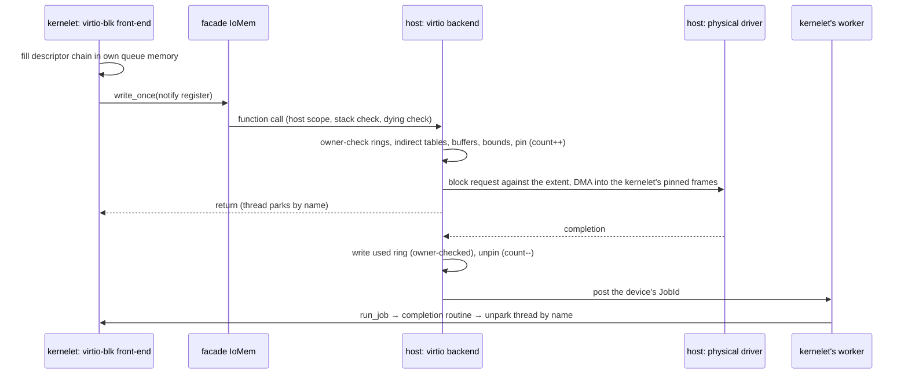

# The backend

Per `VirtioDev` handle the host holds a **device model**: a register struct (device features, driver features, queue selectors, queue addresses, status, config space) and, per queue, a **descriptor walker**. When the front-end writes the queue's notify register, the backend walks the available ring and, for each descriptor chain:

1. **checks every frame it will touch against the [owner array](../memory/frames.md)**: the descriptor table, the available and used rings (at the moment their addresses are written, and a queue's addresses may not change while it has requests in flight), every indirect descriptor table, and every buffer. A descriptor pointing at a frame the calling kernelet does not own is a protocol error that fails the request, not a host panic;
2. **checks bounds and alignment** as the specification requires, and bounds the chain length and the number of in-flight requests per queue (the queue depth is the kernelet's memory bound and its interrupt-rate bound);
3. **pins and translates the request.** Pinning is a count in the owner array (two requests may share a frame) plus a free-pending bit: a pinned frame stays owned by the kernelet, the frame dispatcher will not free or reissue it while the count is nonzero (a kernelet that frees a buffer under DMA sets the bit and the free happens at the last unpin), a queue's descriptor table and rings are pinned for the life of the queue, and destroy waits for every count to reach zero ([§4.7.4](../faults/destroy.md)). Then the request becomes the host's own I/O: a virtio-blk request becomes a host block request against the extent the handle maps to, with the kernelet's pinned frames as the DMA target under `DmaStream`; a virtio-net frame goes to the host's demultiplexer for the flow's MAC; a virtio-console byte stream goes to the rate-limited console sink; a virtio-rng request is filled from host entropy; a virtio-fs request is a FUSE message to the host's file server; a virtio-vsock packet is the ownership transfer of [§4.6](../channels/index.md);
4. **on completion**, writes the used ring in the kernelet's frames (they are still the kernelet's, even if the kernelet is dying, because destroy waits for in-flight requests before releasing anything), unpins the buffers, and posts a `JobId` the front-end registered for the device's interrupt to the kernelet's worker ([§4.4.6](../threads/worker.md)), which a dying kernelet's admission refuses.

The backend runs in a host scope on the calling kernelet's task for the notify path and on the host's completion path for the used-ring write; it holds no pointer into the kernelet beyond the call, only frame numbers, which are kernelet-relative names in the sense of [§4.2.4](../facade/services.md) and are re-checked against the owner array whenever used. All queue memory is the kernelet's own; the host reads and writes it through `VmReader`/`VmWriter` on owner-checked frames, never through a Rust reference, which is what OSTD's untyped-memory rule already requires for memory another party can change underneath you.

**What this removes from Alternative A:** the five device kinds and their bespoke request types; the tokenized rewrite of the `aster-block` completion path (the completion is the used ring, as the specification says); and the question of what a kernelet's `devtmpfs` shows (it shows virtio devices, which is what a VM shows).

**What it keeps:** per-kernelet filesystems, page cache and network stack inside the kernelet, over virtio-blk and virtio-net, so no inode and no socket is shared between kernelets; storage provisioned as fixed extents per kernelet; a host demultiplexer below L4 for the NIC.
