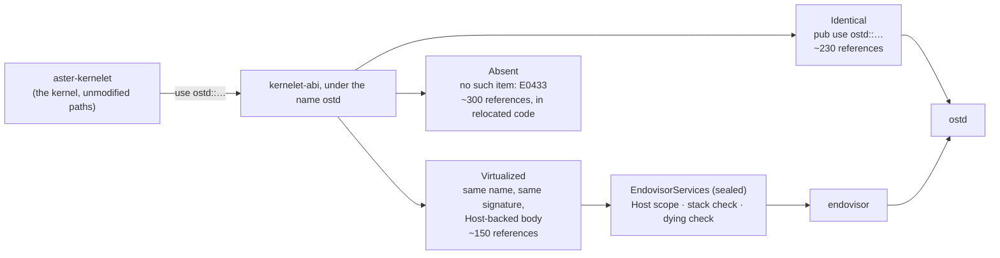

# Three kinds of item, and the edits they force

Every public item of OSTD that the kernel proper uses falls into one of three kinds in the facade. The classification was done over the 685 references at `ab9a4cfdc`, grouped by path; the counts are by grep and are upper bounds.

**Identical** (re-exported as `pub use ostd::...`): items that take no host lock, allocate nothing the host keeps, store no pointer to their argument, and queue no closure. Error types, the prelude, `PAGE_SIZE` and the address types; `VmReader`, `VmWriter`, `VmIo` and the user-memory copies (which fault through the exception table and take no lock); `SpinLock` and `RwLock` (with the guardian substitution of [§4.4.4](../threads/guardians.md)); the RCU *read* side; `UserMode`, `UserContext`, `CpuException` and the FPU context as value types; the clock read; `catch_unwind`; `VmSpace` and its cursor, with the exception [§4.3.4](../memory/address-spaces.md) states. About 230 references. **Edits forced: none.**

**Virtualized** (the facade defines a type of the same name and signature, implemented over the endovisor service trait of [§4.2.4](services.md)): `Task`, `TaskOptions` and `Task::current` (host-owned tasks named by the kernelet, [§4.4.1](../threads/tasks.md)); `IoMem` and `IrqLine` (virtio-over-function-call, [§4.5](../devices/index.md)); `DmaStream` and `DmaCoherent` (an owner check on the kernelet's own frames, and an IOMMU mapping only under passthrough); `FrameAllocOptions` (fallible, against the kernelet's grant); `Mutex`, `RwMutex`, `WaitQueue`, `Waiter`, `Waker` (OSTD's types instantiated with the kernelet guardian, parking by name); `LocalIrqDisabled`, `WriteIrqDisabled` and `disable_local()` (aliases of the preemption guardian, [§4.4.4](../threads/guardians.md)); the log macros (a rate-limited, kernelet-tagged sink that formats at the call site, since a deferred format would read kernelet-heap strings from a host thread); `timer` (arming a wakeup by name on the host wheel); `boot_info`, `num_cpus`, `all_cpus` (the kernelet's view, from its grant and budget). About 150 references. **Edits forced: the shape changes Alternative A already counted**, about 90 sites where thread registers are read and written through a service instead of a struct, and 34 sites where a thread is named instead of referenced.

**Absent**: `cpu_local!` and `cpu_local_cell!` (and no macro or derive that expands to `unsafe`: `forbid(unsafe_code)` does not see `unsafe` that a macro from another crate expands to, so the facade re-exports no such macro and [check 1](../../implementation/checks.md) lists every macro the closure uses); the kernel page table and `KVirtArea`; `smp` and IPIs; `power`; `panic::abort`; the frame-metadata macros (which expand to `unsafe impl`, unseen by the lint); the RCU write side (it queues a kernelet closure into a host per-CPU list and runs it on whichever task switches next); the raw frame allocator; the component registry; `IoPort` and PCI configuration space (the PCI transport is host code, [§4.5.1](../devices/why-virtio.md)). About 300 references, almost all in code that the split of [§4.2.5](split.md) puts in the host. **Edits forced: the handful that remain in the kernel proper**, found by reading: the RCU write side in the process table and the cgroup controller (two sites, which become a kernelet-side reader-writer lock or a deferred job); two `cpu_local!` sites, four objects (`procfs/cpuinfo`, which becomes a per-kernelet table filled from the budget, and the system-wide clock managers, which move to the host with the timer core); `ostd::power` in `reboot(2)`, which becomes `kernelet_exit`; and `panic::abort` in the oops path, which moves to the host with the panic handler. About a dozen sites.

Alternative B's rule for the first kind is that the virtualization layer need not virtualize components whose semantics are local to the guest, `xarray` being its example. Review of Alternative A found four items asserted to be local that were not (a user-memory reader constructor, the RCU write side, the wait queue's internal lock, the cursor's internals), which is why the "identical" list is not a list but an executable test: each item is called under instrumentation that counts host lock acquisitions and scans host structures for window addresses, and must leave both unchanged ([§5.2](../../implementation/checks.md), check 2).
