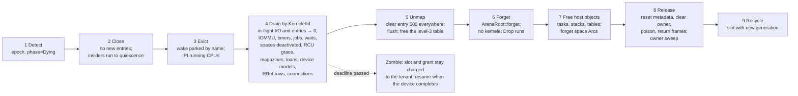

# Destroy, step by step

1. **Detect.** Store the new [epoch](../facade/services.md) and set the phase to Dying. Every handle is stale; admission refuses new entries; [`reenter`](../facade/split.md) returns `None`; the RRef table's rows for this owner are frozen.
2. **Close.** No thread of the kernelet may enter it again, but every thread already inside stays runnable until it reaches a quiescent point, where the [trampoline](tiers.md) marks it dead. (Making them non-runnable first would strand a thread inside a host critical section.)
3. **Evict.** Wake every parked thread of the kernelet with a cancellation result (the host knows them all, since parks are by name); IPI every CPU running one of its threads; each terminates at its next quiescent point, which the tick bounds.
4. **Drain the host's references, by `KerneletId`.** Wait, with a deadline, for the in-flight entry count and the in-flight I/O (virtio requests under DMA, passthrough DMA) to reach zero. Tear down the passthrough IOMMU domain and mask its interrupt. Then: the timer wheel, the job list and every wait table; every address space in the kernelet's space table (deactivate on every CPU where one is active, forget the per-CPU pointer, forget the table's reference; as a backstop, every CPU is asked by IPI to compare the owner of its active root with the dying kernelet and, on a match, to activate the machine's kernel page table through the primitive of [§4.1.3](../process/switch-policy.md)); the cursor's per-CPU flush and deferred-free lists and one synchronous RCU grace period; the per-(CPU, kernelet) [magazines](../memory/per-cpu.md), any death-reserve loans; the virtio device models (their in-flight request records); the RRef rows the kernelet owns (released and refunded, and only now that the in-flight count is zero) and its vsock connections (reset).
5. **Unmap.** Clear [entry 500](../process/two-windows.md), by a direct write to the top-level entry (OSTD's kernel page-table configuration forbids unmapping at the top level through the cursor, so this is part of [change (2)](../../architecture/tcb.md)), in the kernelet's kernel page table and in every `VmSpace` root the kernelet had (all deactivated in step 4, and still alive because they are forgotten rather than dropped), flush, and free the window's level-3 table. From here no virtual address reaches the kernelet's bytes except the linear map, which only OSTD uses. The kernelet's kernel page table itself is the last thing released, in step 8, after every root that shares its nodes.
6. **Forget.** Forget the arena root and the data window through OSTD's `ArenaRoot::forget`. No kernelet `Drop` runs.
7. **Free the host objects.** The kernelet's tasks, stacks, register state, handle table, device models, channel queues, forgetting each task's address-space reference rather than dropping it.
8. **Release.** For every frame of every [grain](../memory/arena.md), of the data window, and of every page-table node the kernelet owned: reset its metadata through OSTD's frame-reset primitive, clear its owner tag, poison it, return it to the pool. Sweep the [owner array](../memory/frames.md) over the kernelet's grains and loaned frames; a straggler is a bug report.
9. **Recycle** the slot with a new generation.

If step 4's deadline passes because a device has not completed, the kernelet becomes a Zombie: its slot and grant stay charged to the tenant, and the remaining steps run when the device completes or on the tenant's next `create`, so that a tenant's stuck Zombies are its own problem. Destroy is an all-CPU IPI event and is rate-limited per tenant.

The soundness of step 8 rests on the same fact as the isolation argument: no reference into the kernelet's windows exists outside the kernelet except through the host structures step 4 drains and the [declared holders](../memory/arena.md) the same steps retire; every other reference is either in an abandoned stack (dead memory by step 7) or a bug that step 5 turned into a fault. Resetting frame metadata that forgotten objects never decremented is outside what `vostd` proves today and is the first item of [§7.2](../../limitations/todos.md).

**Complete reclamation does not depend on `Drop` correctness anywhere in the kernelet crate**, and tearing down a faulted kernelet is the same operation as tearing down a healthy one. The scrub of released frames (a `memset` at about 30 GiB/s, 68 µs per grain) runs synchronously on the destroying thread and is charged to the *tenant's* CPU account, not the dead kernelet's, so that a kernelet killed for burning its quota cannot hold its slot by being unable to pay for its own funeral.
