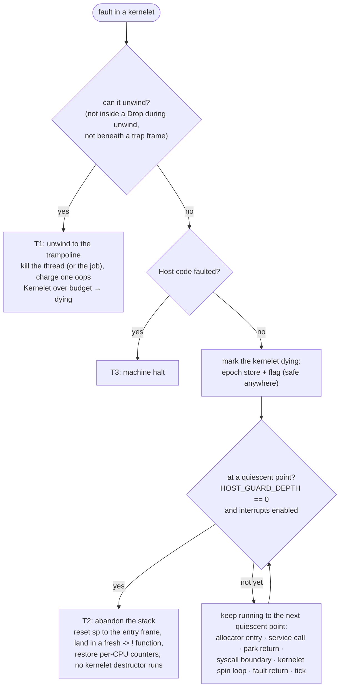

# Three tiers

**T1: unwind and catch, thread-fatal.** A panic in kernelet code unwinds to the trampoline the host wraps around every kernelet task, which is where the kernel's own per-thread catch sits today. The catch kills the thread (or, on the worker, ends the job), charges one oops against the kernelet's own budget, and a kernelet over budget is killed, never escalated to the machine. The panic handler moves to the host and decides "is a kernelet current, can this unwind" from host state alone. A panic inside a `Drop` during unwinding cannot be unwound through and today aborts the machine; every `impl Drop` in the kernelet crate gets a `#[kernelet_drop]` attribute that wraps the body in its own catch, and the general case falls to T2. A kernel-mode page fault taken in a fallible user copy is a separate entry point with its own catch, because a trap frame with no unwind information sits between it and the trampoline.

**T2: abandon the stack at a quiescent point, kernelet-fatal.** For what T1 cannot reach: a panic that cannot unwind, a hard-band memory trip, a tick-budget kill, a stack overflow into the guard page (taken by the double-fault handler of [OSTD change (17)](../../architecture/tcb.md) on its own stack, which marks the kernelet dying and rewrites the exception frame to land here, when the predicate below holds), and forced destroy. OSTD records an entry frame in the task on the way into a kernelet; termination resets the stack pointer to it and enters a fresh `-> !` landing function, restoring OSTD's per-CPU counters, so that no kernelet frame is resumed and no kernelet destructor runs. **Detection** is safe anywhere and is one epoch store plus a flag. **Termination** is safe only where nothing host-owned is live on the discarded frames, and the predicate is exact because of the [guardian split](../threads/guardians.md): `dying && HOST_GUARD_DEPTH == 0 && interrupts enabled`. A dying kernelet reaches such a point at the arena's entry, at the entry to and return from any service call, at the return from a park, at the syscall boundary, in the spin loop of any kernelet lock, at the return from a kernel-mode page fault, and on the tick's return path. The last guarantees progress: a kernelet that stops allocating and stops making syscalls is finished off by the tick, so preemption is load-bearing for the memory answer, not only the CPU answer.

**T3: a panic in host code.** Not containable. The machine halts, as it does when a hypervisor panics. What makes it tolerable is that the host's hot paths are short, that host code is entered with kernelet-supplied *values* and never callbacks, and that the stack check of [§4.4.5](../threads/stack-check.md) keeps a kernelet from arranging a host overflow.
