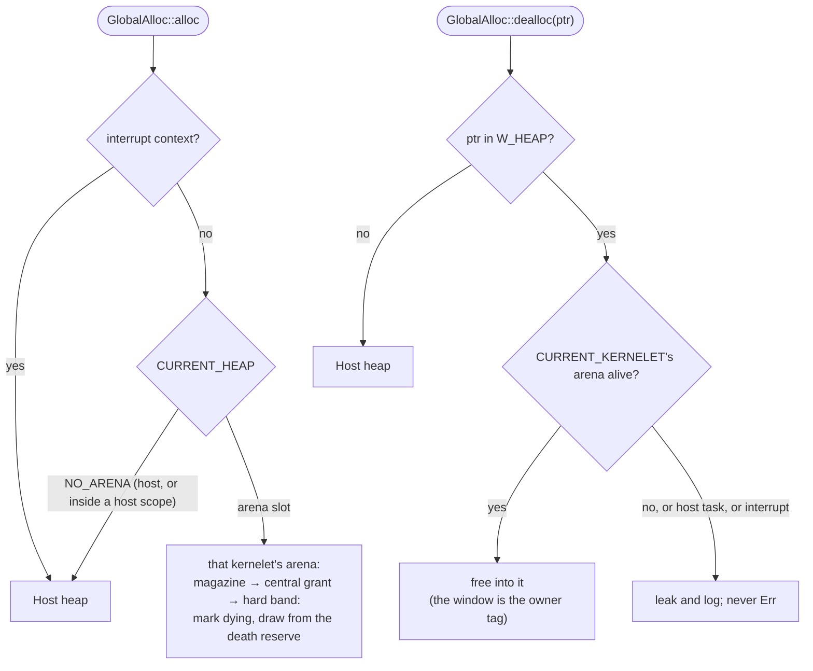

# The arena, and who is running

`Box::new` bottoms out in `GlobalAlloc::alloc(Layout)`, which has no context parameter, so the only way to give each kernelet its own heap is a global allocator that dispatches on the current kernelet. OSTD's allocator shim forwards to two safe hook traits the kernel binds; the host binds dispatching implementations instead. The dispatch reads three per-task attribution words that OSTD keeps in a module the facade never re-exports, saved and restored with the task by the host's schedule handlers, and a fourth for the lock depth of [§4.4.4](../threads/guardians.md):

- `CURRENT_KERNELET`: whose time and whose oops this is;
- `CURRENT_HEAP`: which arena, as a slot in the host's arena table, `NO_ARENA` meaning the host heap;
- `FRAMES_FOR`: whose grant a *frame* request draws from;
- `HOST_GUARD_DEPTH`: how many host locks the task holds ([§4.4.4](../threads/guardians.md)).

In interrupt context none is consulted: handlers allocate host memory, so a receive-ring refill in an interrupt is never charged to whoever was interrupted.

A kernelet's arena is carved from its `MemArena` grant in 2 MiB grains, each frame owner-tagged once at grant time in a host-side array of one word per physical frame. Inside a grain the slab allocator runs with its slots addressed through the heap window ([§4.1.5](../process/heap-window.md), OSTD change (16)). Deallocation goes by the *address*, never by the heap word: a window address belongs to the arena of the kernelet the current task serves (`CURRENT_KERNELET`, which a host scope leaves set), a linear-map address to the host heap, so the dispatcher needs no lookup, and charging by "whoever runs", which a model showed to be wrong in both directions (17× over quota with the books reading exactly at quota), never arises. The `dealloc` path never returns `Err`, since an `Err` there is a machine abort today; a free into a dead arena leaks and logs without touching the slot.

**Rule 1: every host service runs in a host scope.** The wrapper of [§4.2.4](../facade/services.md) sets `CURRENT_HEAP` to `NO_ARENA` and `FRAMES_FOR` to none before delegating, so host code never allocates out of a tenant's arena and host structures never end up in frames a later release hands back. In a model without this rule, a host-side log appended on every clock read ate a tenant's quota and then sat in frames the tenant's destroy released. **Rule 2: the host retains only kernelet-relative names**, with four **declared holders**, each pointing into a kernelet's memory by construction and each retired at a named step of [§4.7.4](../faults/destroy.md): the strong reference to a `VmSpace` in every `Task` bound to it; OSTD's per-CPU pointer to the active `VmSpace`; the host's per-kernelet table of address spaces ([§4.3.4](address-spaces.md)); and the `ArenaRoot` through which OSTD dereferences the arena and the data window for the host. Anything else is a bug, and now, in thread context, a fault. (An `RRef`, [§4.6.2](../channels/rref.md), is a pointer a *kernelet* holds into *host* memory, the other direction, and is not a holder in this sense.)
