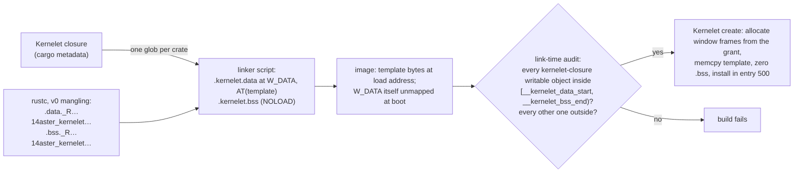

# Putting the kernelet crate's sections in the data window

The linker script does it. OSDK's script already assigns each output section a virtual address and, with `AT()`, a separate load address, and the boot loader places bytes by their load address without mapping their virtual one, so a section whose virtual address is [`W_DATA`](two-windows.md) and whose bytes sit in the image is loadable as a **template**. The selection of *which* writable objects go there cannot be by archive name, because OSDK's release profiles link with LTO and the linker then sees merged objects, not `.rlib` members. It is by **symbol name**: rustc emits every static into its own section, `.data.<mangled name>` or `.bss.<mangled name>`, and under the `v0` mangling scheme, which the toolchain defaults to and OSDK will pin, the mangled name carries the crate name (the tree's artifact already shows sections named `.data._RNv…10aster_core…`), so one glob per crate in the kernelet closure selects that crate's writable objects:

```ld
/* osdk/src/base_crate/x86_64.ld.template, sketch; one glob per crate in the kernelet closure */
.kernelet.data W_DATA : AT(ADDR(.kernelet.data) - KERNELET_TEMPLATE_OFFSET) {
    __kernelet_data_start = .;
    *(.data._R*14aster_kernelet* .data._R*8ext2* .data._R*5exfat* ...)
    __kernelet_data_end = .;
}
.kernelet.bss (NOLOAD) : { __kernelet_bss_start = .; *(.bss._R*14aster_kernelet* ...) __kernelet_bss_end = .; }
/* and, before the generic .data rule: */
.rodata : { ... *(.data.rel.ro .data.rel.ro.*) }   /* read-only after relocation; today folded into .data; thousands carry no crate name */
```

The list of crates is the dependency closure of `aster-kernelet` ([§4.2.2](../facade/crate-graph.md)), the same closure the crate-graph check computes, and the build generates the globs from it. Alternative A's link-time audit tool, which already demangles `v0` names to attribute every writable object to a crate, is reused with its question inverted: **is every writable object of a crate in the kernelet closure inside `[__kernelet_data_start, __kernelet_bss_end)`, and every writable object of every other crate outside it?** Whether LTO preserves the section name of every surviving static, including internalized ones, is the first thing to test ([§7.2](../../limitations/todos.md), item 2).

Crates that both the kernelet closure and the host use (`alloc`, `hashbrown`, `smoltcp`, `log`, `spin`) are the case to watch. Their writable objects are placed on the host side, and the rule for them is Alternative A's "immutable after boot" bucket: a shared crate's static may be *written* only by the host at boot (the `log` crate's logger and level are the example) and only *read* by kernelets afterwards. The audit lists every such object, and each needs a one-line justification. A static in a shared crate that kernelet code writes at run time would be a cross-kernelet channel, and if one is found the crate is duplicated for the kernelet side under another name.

When the host creates a kernelet it allocates the data window's frames from the kernelet's grant, copies the template into them, zeroes the `.bss` part, and installs them in the kernelet's level-3 table. Creating a kernelet's data segment is a `memcpy` of a few pages.



**What is not in the window.** `.cpu_local` is per CPU, not per kernelet; a kernelet crate may not declare one (`cpu_local!` is not in the facade, and the audit rejects a kernelet-closure object in `.cpu_local`). `.rodata`, `.data.rel.ro` and `.text` are shared and read-only. Kernel stacks are host objects ([§4.4.1](../threads/tasks.md)). The vmalloc area and the linear map are shared, and a kernelet reaches them only through OSTD types that check the frame's owner.
