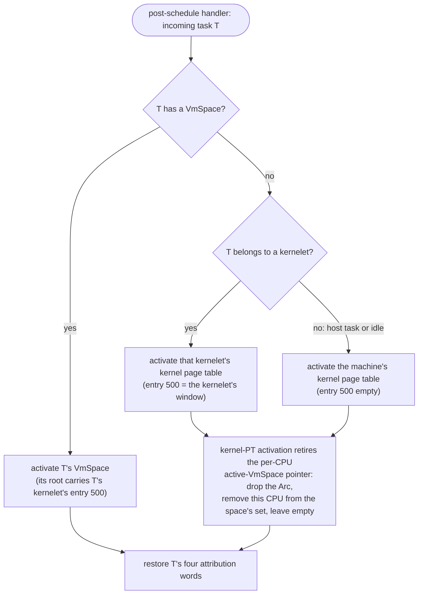

# The switch policy: every task activates its own page table

Today the kernel's post-schedule handler activates a page table only when the incoming task has a `VmSpace`; a kernel-only task, the idle loop and the host's own threads run on whatever page table the previous task left in CR3, and OSTD's `KERNEL_PAGE_TABLE` is activated at boot and then almost never. Under the windows that is wrong twice: a host task would run with the last kernelet's window mapped, and a kernelet's worker following another kernelet's task would run with the *wrong* window. So:

> **The post-schedule handler activates the incoming task's page table, always**: its `VmSpace` if it has one; its kernelet's kernel page table if it is a kernelet task without one; the machine's kernel page table if it is a host task, the idle task included.

Activating a kernel page table is new to OSTD (change (19) in [§5.1](../../implementation/ostd-changes.md)), and its bookkeeping is the point: OSTD keeps a per-CPU pointer to the active `VmSpace`, holding a strong reference, and `VmSpace::activate` returns early when the incoming space is the one already recorded. The new primitive therefore, before writing CR3, takes that reference out of the per-CPU pointer, removes the CPU from the space's "active on" set, drops the reference (never the last one, because the host's space table of [§4.3.4](../memory/address-spaces.md) holds one), and leaves the pointer empty, so that the next `VmSpace::activate` on this CPU does the full activation. Interrupt handlers run on whatever page table the interrupted task had and touch no window.

**Cost.** A CR3 write on every switch between tasks of different page tables, host and idle tasks included, where today a kernel-only task pays none. And, without PCIDs, every CR3 write drops every non-Global translation: today the user half and the kernel stacks; under this design also both windows, **including on a switch between two tasks of the same kernelet**, since their `VmSpace`s differ. That is the price of the backstop of [§4.1.5](heap-window.md), and it is stated rather than hidden: a same-kernelet process switch re-walks the heap-window translations its predecessor had warmed. Two things bound it. The windows are mapped with 2 MiB entries (one entry per grain), so a warm heap is a handful of translations. And PCIDs would remove the flush, since a tagged translation can stay in the TLB across a CR3 write; but the tree's TLB coherence is built on the fact that a CR3 write flushes everything non-Global (the vmalloc area is unmapped with no flush, a kernel stack's flush is one `invlpg` in the current context, and a space's "active on" set means where it is active now, not who may still cache its entries), so PCIDs are not a flag to set but a change to OSTD's coherence model, listed as change (18) with what it must redefine, and not assumed by anything in this book. Milestone 1 measures the flush cost against the booted prototype, which paid none of it **[unverified]**.

The booted prototype measured what this design does *not* pay: a guest-to-hypervisor call is a function call, and a guest page fault is a native page fault ([§2.2](../../background/prototype.md)).
