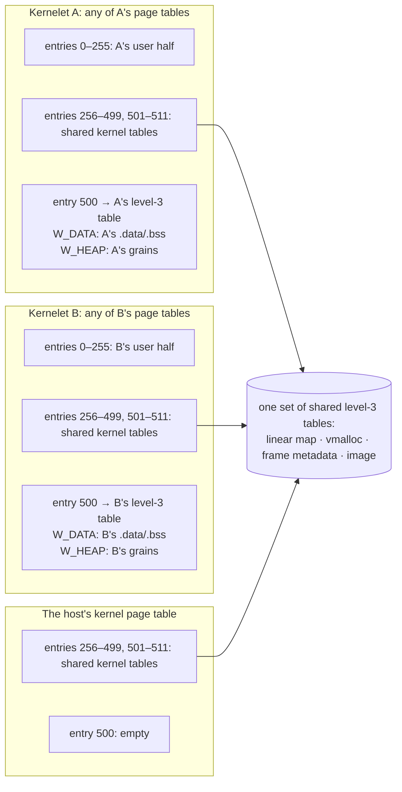

# Two windows

On x86-64 the kernel half is top-level entries 256–511 (each 512 GiB), all of which have a level-3 table allocated at boot and shared into every user page table ([§2.1](../../background/asterinas.md)). OSTD uses entries 256–383 for the linear map of physical memory, 384–447 for the vmalloc area, 448–449 for the frame-metadata array, and 511 for the image; entries 450–510 are an unused hole. This design reserves one entry in the hole, entry 500 say, as the **kernelet window**: a 512 GiB region of the kernel half whose level-3 table is *not* shared but *per kernelet*. Inside it, two fixed sub-ranges:

- the **data window**, at a fixed virtual address `W_DATA`, with 16 MiB reserved and a few pages mapped: the kernelet crate's `.data` and `.bss` (the tree's kernel library has 17 KiB of writable roots in the linked image, 13.5 KiB of data and 3.6 KiB of zeroed);
- the **heap window**, at `W_HEAP`, with the largest arena a kernelet may be granted reserved (a build-time constant, 64 GiB in this book) and the kernelet's arena grains ([§4.3](../memory/index.md)) mapped into it as they are granted.

```
top-level entry   region                              shared?
256..383          linear map of physical memory       shared, Global
384..447          vmalloc (KVirtArea)                 shared, Global
448..449          frame metadata                      shared, Global
450..499          hole                                shared, empty
500               THE KERNELET WINDOW                 level-3 table PER KERNELET, not Global
                    W_DATA  16 MiB reserved   this kernelet's .data/.bss copy
                    W_HEAP  64 GiB reserved   this kernelet's arena grains
501..510          hole                                shared, empty
511               the image (text, rodata, host data) shared, Global
```



A kernelet's **kernel page table** is the machine's kernel page table with entry 500 replaced by that kernelet's level-3 table; it is created with the kernelet and lives as long as the kernelet (OSTD's shared-node rule requires the parent of a user page table to outlive it, so the kernelet's kernel page table is retired last, [§4.7.4](../faults/destroy.md)). Every `VmSpace` the kernelet creates copies its top-level kernel entries from the kernelet's kernel page table rather than the machine's. A kernelet's tasks, with or without a `VmSpace`, run on a page table whose entry 500 is theirs; the host's own tasks run on the machine's kernel page table, in which entry 500 maps nothing. Making that last sentence true is the switch policy of [§4.1.3](switch-policy.md).

The window's entries are ordinary kernel mappings except that they are **not Global**: a Global entry survives a CR3 write, and a surviving translation for `W_DATA` from kernelet A used while kernelet B runs would be a cross-kernelet read. (The tree's kernel stacks are already non-Global for the same reason; the windows join them.) Everything else in the kernel half is shared and Global as today.
